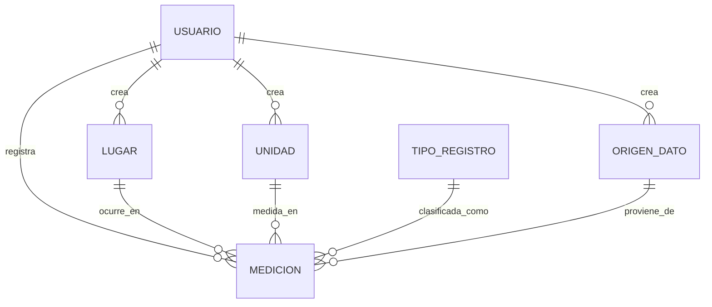

# Base de Datos

El sistema utiliza PostgreSQL como motor de base de datos, gestionado a través de Prisma ORM.

## Modelo de Datos

### Entidades Principales

1.  **Usuario**: Almacena credenciales y roles (ADMIN, EQUIPO, PUBLICO).
2.  **Medicion**: El núcleo del sistema. Registra valores numéricos asociados a un lugar, unidad, origen y tipo.
3.  **Lugar**: Ubicaciones geográficas donde se realizan las mediciones. Soporta coordenadas GSP (Lat/Long).
4.  **Unidad**: Unidades de medida (ej. mg/L, °C, etc.).
5.  **TipoRegistro**: Clasificación del origen del dato (ej. PRUEBA, MUESTRA, DATO_PREVIO).
6.  **OrigenDato**: La fuente desde donde proviene la información.

### Esquema de Relaciones (Mermaid)

## Estrategias de Optimización

### Índices de Base de Datos
Se han implementado índices estratégicos en la tabla `mediciones` para acelerar las consultas más frecuentes:
- `fecha_medicion`: Para reportes históricos rápidos.
- `lugar_id`, `unidad_id`, `tipo_id`, `origen_id`: Para filtrado dinámico en dashboards.
- `deleted_at`: Para optimizar el filtrado de registros activos.

### Borrado Lógico (Soft Delete)
Todas las entidades críticas implementan un campo `deleted_at`.
- **Ventaja**: Facilita la recuperación de datos ante errores humanos y mantiene la integridad de reportes históricos.
- **Nota**: Al realizar consultas Prisma, siempre se debe incluir el filtro `{ deleted_at: null }`.
