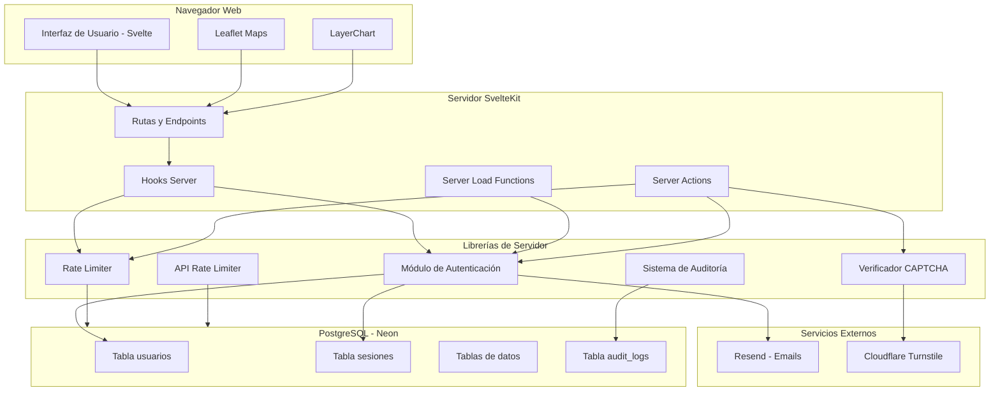
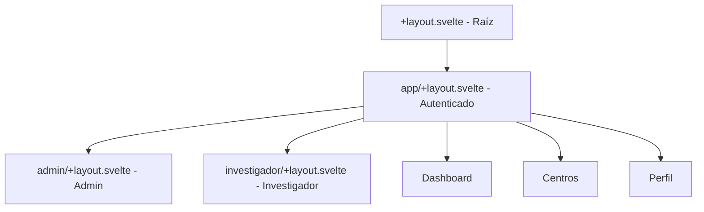
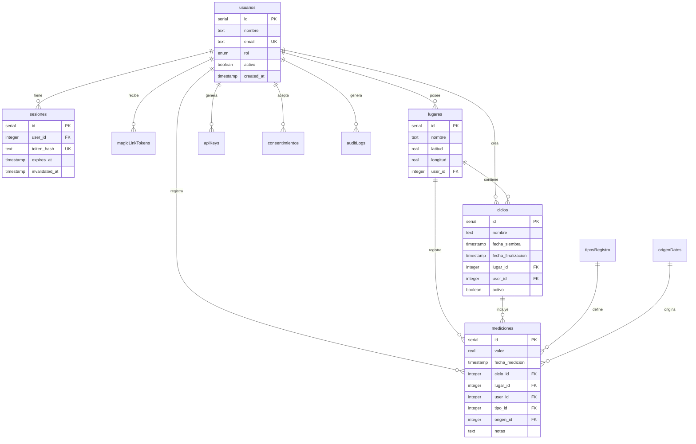
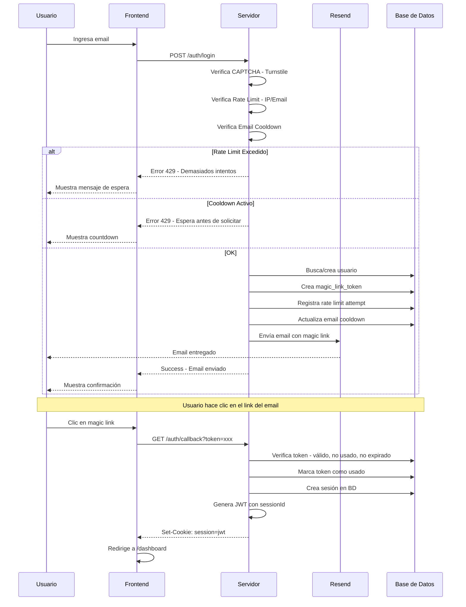
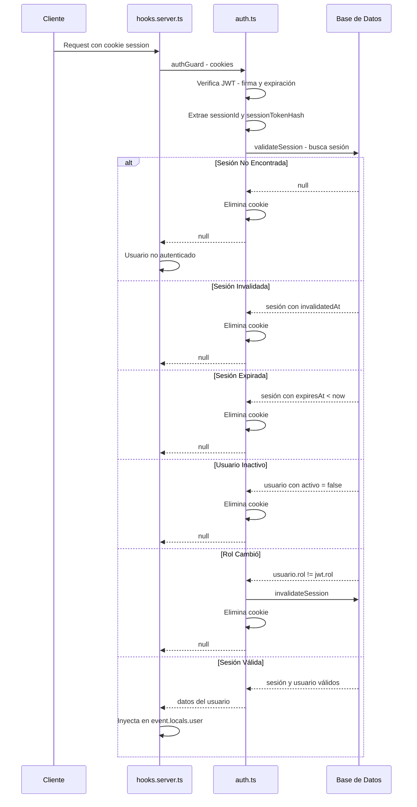
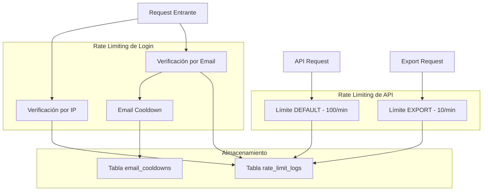
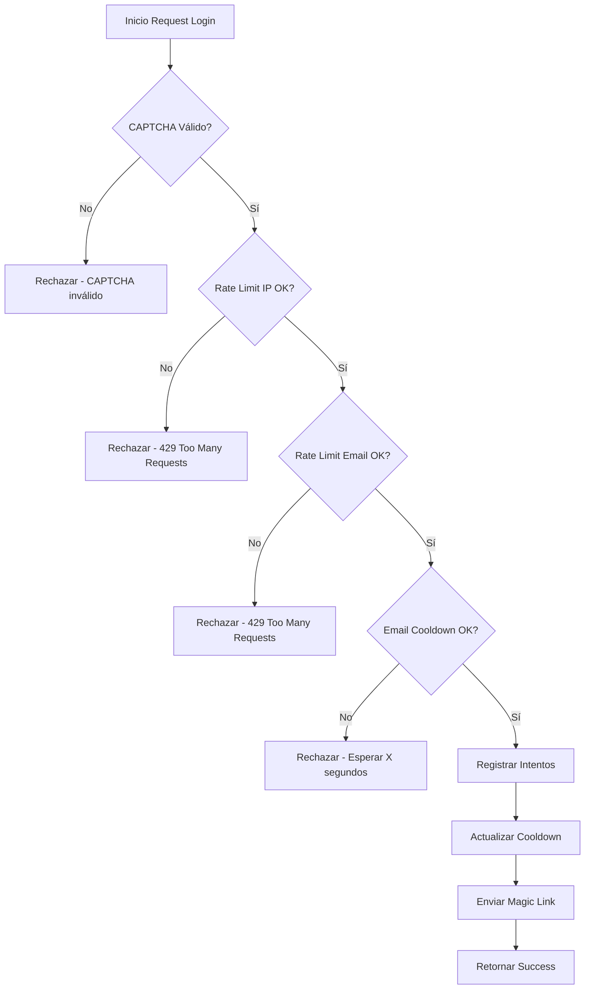
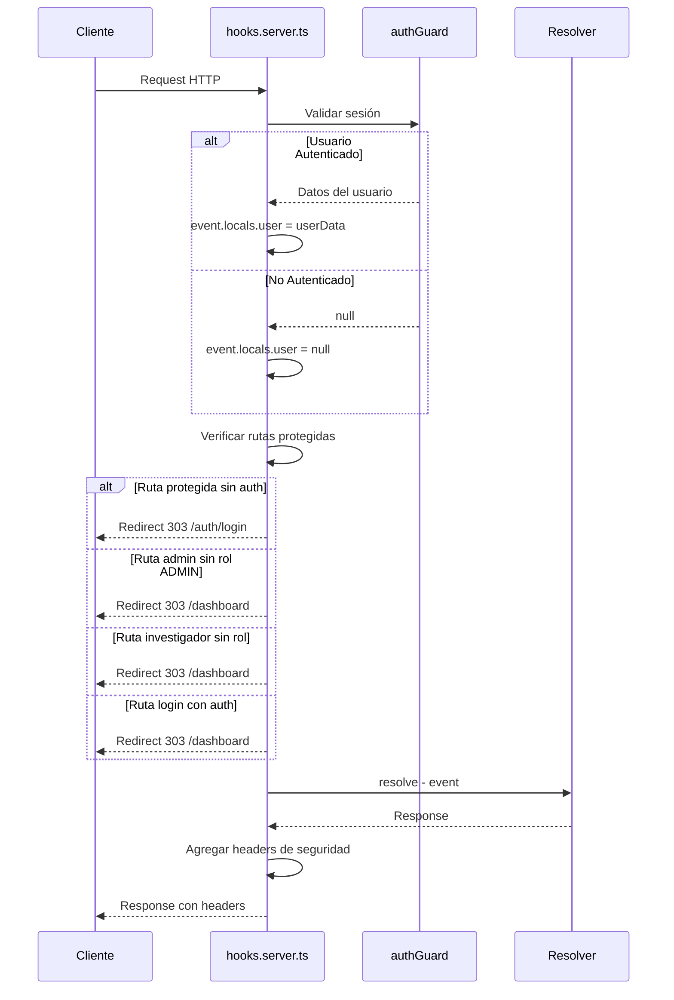
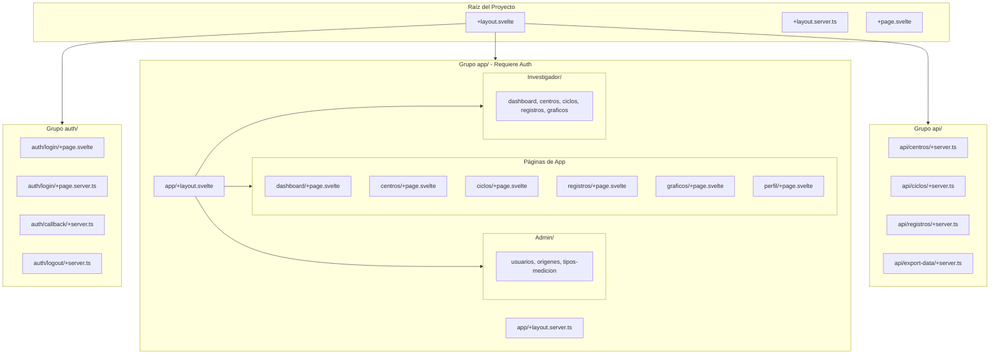
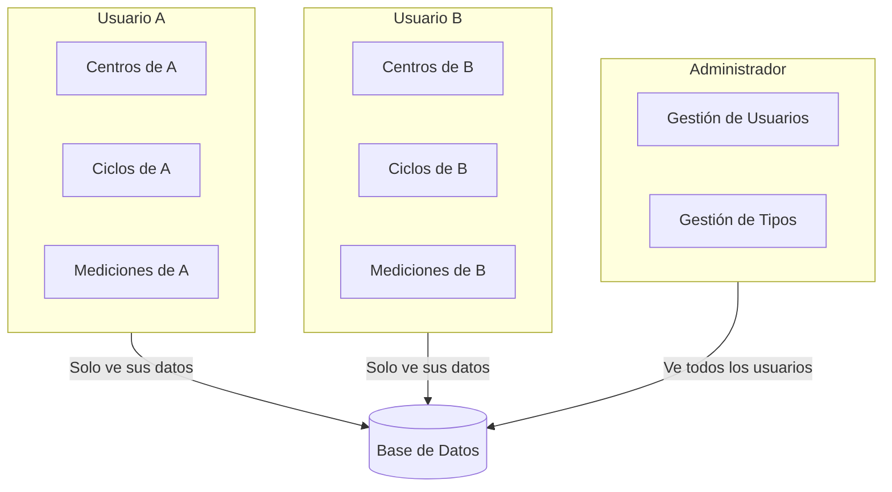

# Arquitectura del Sistema - MytilusData

Este documento describe la arquitectura técnica del sistema MytilusData, incluyendo sus capas, componentes, flujos de datos y decisiones de diseño.

## Diagrama de Arquitectura General



## Descripción de Capas

### 1. Capa de Presentación (Frontend)

La capa de presentación está construida con **Svelte 5** y **SvelteKit**, utilizando el paradigma de componentes reactivos.

#### Componentes Principales

| Directorio | Propósito |
|------------|-----------|
| `src/lib/components/ui/` | Componentes base shadcn-svelte (Button, Input, Card, etc.) |
| `src/lib/components/layout/` | Componentes de estructura (Header, Sidebar) |
| `src/lib/components/centros/` | Componentes para gestión de centros |
| `src/lib/components/ciclos/` | Componentes para gestión de ciclos |
| `src/lib/components/registros/` | Componentes para gestión de registros |
| `src/lib/components/graficos/` | Componentes de visualización |

#### Tecnologías de UI

- **TailwindCSS 4**: Estilos utilitarios
- **bits-ui**: Primitivos de UI accesibles
- **Lucide Icons**: Iconografía
- **mode-watcher**: Tema claro/osculo

### 2. Capa de Aplicación (Backend)

La capa de aplicación maneja la lógica de negocio, autenticación y autorización.

#### Rutas de SvelteKit

```mermaid
graph LR
    subgraph Publicas [Rutas Públicas]
        Home[/ - Inicio]
        Login[/auth/login]
        Callback[/auth/callback]
        Acerca[/acerca-de]
        Terminos[/condiciones-servicios]
    end

    subgraph App [Rutas Autenticadas - Grupo app]
        Dashboard[/dashboard]
        Centros[/centros]
        Ciclos[/ciclos]
        Registros[/registros]
        Graficos[/graficos]
        Perfil[/perfil]
    end

    subgraph Admin [Rutas Admin]
        Usuarios[/admin/usuarios]
        Origenes[/admin/origenes]
        TiposMed[/admin/tipos-medicion]
    end

    subgraph Investigador [Rutas Investigador]
        InvDash[/investigador/dashboard]
        InvCentros[/investigador/centros]
        InvCiclos[/investigador/ciclos]
        InvReg[/investigador/registros]
        InvGraf[/investigador/graficos]
    end

    subgraph API [API REST]
        APICentros[/api/centros]
        APICiclos[/api/ciclos]
        APIReg[/api/registros]
        APIExport[/api/export-data]
    end
```

#### Layouts Anidados



### 3. Capa de Datos (Base de Datos)

La capa de datos utiliza **PostgreSQL** (via Neon) con **Drizzle ORM**.

#### Esquema de Base de Datos



## Flujo de Autenticación

### Diagrama de Secuencia - Magic Link



### Validación de Sesión



## Sistema de Rate Limiting

El sistema implementa múltiples capas de rate limiting para proteger contra abuso.

### Arquitectura de Rate Limiting



### Configuración de Límites

| Tipo | Límite | Ventana | Propósito |
|------|--------|---------|-----------|
| IP (Login) | 5 intentos | 15 minutos | Prevenir ataques de fuerza bruta por IP |
| Email (Login) | 3 intentos | 1 hora | Prevenir spam de magic links |
| Email Cooldown | 1 envío | 60 segundos | Evitar envíos duplicados |
| API DEFAULT | 100 solicitudes | 1 minuto | Uso normal de API |
| API EXPORT | 10 solicitudes | 1 minuto | Exportaciones (más costosas) |

### Flujo de Rate Limiting en Login



## Middleware y Hooks

### hooks.server.ts

El archivo [`src/hooks.server.ts`](../src/hooks.server.ts) es el punto de entrada para todas las solicitudes al servidor.



### Headers de Seguridad

Para todas las respuestas de API:

| Header | Valor | Propósito |
|--------|-------|-----------|
| `X-Content-Type-Options` | `nosniff` | Prevenir MIME sniffing |
| `X-Frame-Options` | `DENY` | Prevenir clickjacking |
| `X-XSS-Protection` | `1; mode=block` | Protección XSS |
| `Referrer-Policy` | `strict-origin-when-cross-origin` | Control de referrer |
| `Cache-Control` | `no-store, no-cache, must-revalidate` | No cachear datos sensibles |

## Estructura de Rutas y Layouts

### Sistema de Layouts de SvelteKit



### Protección de Rutas

| Patrón de Ruta | Protección | Implementación |
|----------------|------------|----------------|
| `/dashboard/*` | Autenticación | `hooks.server.ts` |
| `/centros/*` | Autenticación | `hooks.server.ts` |
| `/ciclos/*` | Autenticación | `hooks.server.ts` |
| `/registros/*` | Autenticación | `hooks.server.ts` |
| `/graficos/*` | Autenticación | `hooks.server.ts` |
| `/perfil/*` | Autenticación | `hooks.server.ts` |
| `/admin/*` | Rol ADMIN | `hooks.server.ts` |
| `/investigador/*` | Rol INVESTIGADOR o ADMIN | `hooks.server.ts` |
| `/api/*` | API Key o Sesión | Cada endpoint |
| `/auth/login` | Redirigir si autenticado | `hooks.server.ts` |

## Sistema de Auditoría

### Eventos Registrados

| Evento | Código | Descripción |
|--------|--------|-------------|
| Login exitoso | `LOGIN_SUCCESS` | Usuario inició sesión |
| Login fallido | `LOGIN_FAILED` | Intento de login fallido |
| Logout | `LOGOUT` | Usuario cerró sesión |
| Magic Link enviado | `MAGIC_LINK_SENT` | Email de magic link enviado |
| API Key generada | `API_KEY_GENERATED` | Usuario generó nueva API key |
| API Key revocada | `API_KEY_REVOKED` | Usuario revocó API key |
| Acceso a API | `API_ACCESS` | Solicitud a endpoint de API |
| Exportación de datos | `DATA_EXPORT` | Usuario exportó datos |
| Cambio de rol | `ROLE_CHANGE` | Admin cambió rol de usuario |
| Usuario creado | `USER_CREATED` | Nuevo usuario registrado |

### Estructura de Log

```typescript
interface AuditLogEntry {
  id: number;
  userId?: number;        // Usuario que realizó la acción
  accion: string;         // Código del evento
  entidad?: string;       // Entidad afectada (usuario, api_key, etc.)
  entidadId?: number;     // ID de la entidad
  ip?: string;            // Dirección IP
  userAgent?: string;     // User agent del cliente
  detalles?: string;      // JSON con información adicional
  createdAt: Date;        // Timestamp del evento
}
```

## Multi-Tenancy

El sistema implementa aislamiento de datos por usuario (multi-tenancy):

### Implementación

1. **Todas las tablas de datos incluyen `userId`**:
   - `lugares.userId`
   - `ciclos.userId`
   - `mediciones.userId`

2. **Consultas filtradas por usuario**:
   ```typescript
   // Ejemplo en centros
   const userCentros = await db
     .select()
     .from(lugares)
     .where(eq(lugares.userId, apiKeyRecord.userId));
   ```

3. **API Keys vinculadas a usuario**:
   - Cada API key está asociada a un único usuario
   - Las consultas API usan el userId de la API key

### Diagrama de Aislamiento



## Decisiones Arquitectónicas

### 1. Autenticación Passwordless

**Decisión**: Usar Magic Links en lugar de contraseñas tradicionales.

**Justificación**:
- Elimina problemas de contraseñas débiles
- Reduce superficie de ataque (no hay contraseñas que robar)
- Mejor experiencia de usuario (no recordar contraseñas)
- Cumple con principios de seguridad moderna

### 2. Sesiones en Base de Datos

**Decisión**: Almacenar sesiones en BD en lugar de JWT stateless puro.

**Justificación**:
- Permite invalidar sesiones inmediatamente
- Control granular (logout, desactivación de usuario, cambio de rol)
- Auditoría de sesiones activas
- Trade-off: Mayor latencia en cada request, pero mayor seguridad

### 3. Rate Limiting en Base de Datos

**Decisión**: Usar BD para rate limiting en lugar de memoria.

**Justificación**:
- Funciona en entornos serverless/multi-instancia
- Persistencia entre reinicios
- Sin dependencia de Redis u otro servicio
- Trade-off: Mayor latencia, pero arquitectura más simple

### 4. Drizzle ORM

**Decisión**: Usar Drizzle en lugar de Prisma.

**Justificación**:
- SQL-like, más cercano a la base de datos
- Sin generación de código adicional
- Mejor rendimiento en serverless
- Migraciones más predecibles

### 5. SvelteKit sobre Next.js

**Decisión**: Usar SvelteKit como framework.

**Justificación**:
- Menor bundle size
- Sintaxis más simple y reactiva
- Mejor DX para proyectos pequeños/medianos
- Server-side rendering nativo

## Consideraciones de Escalabilidad

### Cuellos de Botella Potenciales

1. **Validación de sesión en BD**: Cada request autenticado consulta la BD
   - **Mitigación**: Caché de sesiones válidas con TTL corto

2. **Rate Limiting en BD**: Consultas en cada request
   - **Mitigación**: Implementar con Redis para alto tráfico

3. **Consultas de datos sin índices**: Tablas de mediciones pueden crecer mucho
   - **Mitigación**: Índices en `userId`, `fechaMedicion`, `cicloId`

### Recomendaciones para Producción

1. **Connection Pooling**: Configurar pool de conexiones PostgreSQL
2. **CDN**: Servir assets estáticos desde CDN
3. **Monitoring**: Implementar APM (Application Performance Monitoring)
4. **Logging**: Centralizar logs con servicio externo
5. **Backups**: Configurar backups automáticos de BD

## Próximos Pasos

Para más detalles sobre la API REST, consultar [api.md](./api.md).
