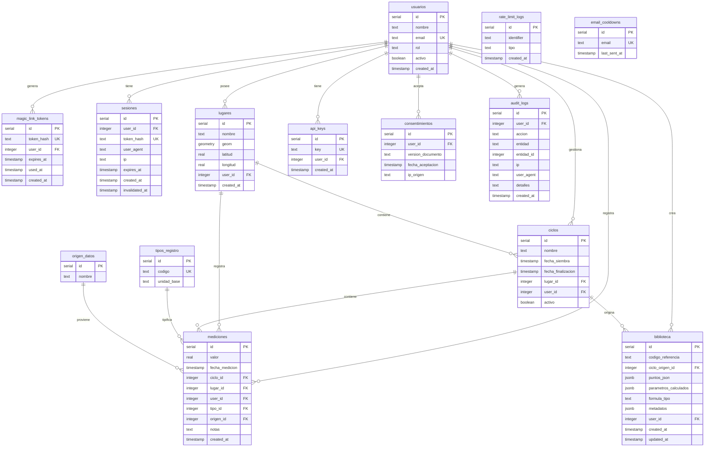

# Documentación de Base de Datos - MytilusData

**Fecha:** 2026-03-19  
**Versión:** 1.0  
**Audiencia:** Desarrolladores, DBAs, mantenedores

---

## Propósito

Este documento describe el esquema de base de datos de MytilusData, incluyendo la estructura de tablas, relaciones, índices y procedimientos de migración. Permite a desarrolladores y administradores entender, mantener y extender el modelo de datos.

---

## Visión General

### Tecnología

| Componente | Tecnología | Versión |
|------------|------------|---------|
| Base de datos | PostgreSQL (Neon Serverless) | - |
| Extensión espacial | PostGIS | - |
| ORM | Drizzle ORM | 0.45.1 |
| Migraciones | Drizzle Kit | 0.31.9 |

### Características Principales

- **Multi-tenancy:** Aislamiento de datos por `userId` en todas las tablas productivas
- **Datos geoespaciales:** PostGIS para almacenamiento y consulta de coordenadas
- **Auditoría:** Trazabilidad de acciones mediante logs de auditoría
- **Seguridad:** Tokens hasheados, rate limiting basado en BD

---

## Diagrama Entidad-Relación



---

## Descripción de Tablas

### Sistema de Autenticación

#### [`usuarios`](../src/lib/server/db/schema/auth.ts)

Almacena los usuarios del sistema con roles RBAC.

| Campo | Tipo | Restricciones | Descripción |
|-------|------|---------------|-------------|
| `id` | serial | PK | Identificador único |
| `nombre` | text | NOT NULL | Nombre del usuario |
| `email` | text | NOT NULL, UNIQUE | Email del usuario |
| `rol` | text | DEFAULT 'USUARIO' | Rol: USUARIO, INVESTIGADOR, ADMIN |
| `activo` | boolean | DEFAULT true | Estado de la cuenta |
| `created_at` | timestamp | DEFAULT now() | Fecha de creación |

#### [`magic_link_tokens`](../src/lib/server/db/schema/auth.ts)

Tokens para autenticación passwordless vía email.

| Campo | Tipo | Restricciones | Descripción |
|-------|------|---------------|-------------|
| `id` | serial | PK | Identificador único |
| `token_hash` | text | NOT NULL, UNIQUE | Hash SHA-256 del token |
| `user_id` | integer | NOT NULL, FK → usuarios | Usuario asociado |
| `expires_at` | timestamp | NOT NULL | Fecha de expiración |
| `used_at` | timestamp | NULL | Fecha de uso (null si no usado) |
| `created_at` | timestamp | DEFAULT now() | Fecha de creación |

#### [`sesiones`](../src/lib/server/db/schema/auth.ts)

Sesiones activas con JWT.

| Campo | Tipo | Restricciones | Descripción |
|-------|------|---------------|-------------|
| `id` | serial | PK | Identificador único |
| `user_id` | integer | NOT NULL, FK → usuarios | Usuario asociado |
| `token_hash` | text | NOT NULL, UNIQUE | Hash del token de sesión |
| `user_agent` | text | NULL | User agent del navegador |
| `ip` | text | NULL | Dirección IP |
| `expires_at` | timestamp | NOT NULL | Fecha de expiración (7 días) |
| `created_at` | timestamp | DEFAULT now() | Fecha de creación |
| `invalidated_at` | timestamp | NULL | Fecha de invalidación |

---

### Estructura Productiva

#### [`lugares`](../src/lib/server/db/schema/productive.ts)

Centros de cultivo con ubicación geográfica.

| Campo | Tipo | Restricciones | Descripción |
|-------|------|---------------|-------------|
| `id` | serial | PK | Identificador único |
| `nombre` | text | NOT NULL | Nombre del centro |
| `geom` | geometry(Point, 4326) | NULL | Punto geográfico PostGIS |
| `latitud` | real | NULL | Latitud (legacy, mantener para rollback) |
| `longitud` | real | NULL | Longitud (legacy, mantener para rollback) |
| `user_id` | integer | NOT NULL, FK → usuarios | Propietario |
| `created_at` | timestamp | DEFAULT now() | Fecha de creación |

**Índice:** `idx_lugares_geom` (GIST) para consultas espaciales.

#### [`ciclos`](../src/lib/server/db/schema/productive.ts)

Períodos de cultivo desde siembra hasta cosecha.

| Campo | Tipo | Restricciones | Descripción |
|-------|------|---------------|-------------|
| `id` | serial | PK | Identificador único |
| `nombre` | text | NOT NULL | Nombre del ciclo |
| `fecha_siembra` | timestamp | NOT NULL | Fecha de siembra |
| `fecha_finalizacion` | timestamp | NULL | Fecha de cosecha (null si activo) |
| `lugar_id` | integer | NOT NULL, FK → lugares | Centro de cultivo |
| `user_id` | integer | NOT NULL, FK → usuarios | Propietario |
| `activo` | boolean | DEFAULT true | Estado del ciclo |

---

### Tablas Maestras

#### [`tipos_registro`](../src/lib/server/db/schema/master.ts)

Catálogo de tipos de medición.

| Campo | Tipo | Restricciones | Descripción |
|-------|------|---------------|-------------|
| `id` | serial | PK | Identificador único |
| `codigo` | text | NOT NULL, UNIQUE | Código del tipo (ej: TALLA, BIOMASA) |
| `unidad_base` | text | NOT NULL | Unidad canónica (ej: mm, g, C) |

#### [`origen_datos`](../src/lib/server/db/schema/master.ts)

Origen de los datos de medición.

| Campo | Tipo | Restricciones | Descripción |
|-------|------|---------------|-------------|
| `id` | serial | PK | Identificador único |
| `nombre` | text | NOT NULL | Nombre del origen (Manual, Satelital, PSMB) |

---

### Mediciones

#### [`mediciones`](../src/lib/server/db/schema/measurements.ts)

Tabla central de datos de muestreo.

| Campo | Tipo | Restricciones | Descripción |
|-------|------|---------------|-------------|
| `id` | serial | PK | Identificador único |
| `valor` | real | NOT NULL | Valor numérico normalizado |
| `fecha_medicion` | timestamp | NOT NULL | Fecha de la medición |
| `ciclo_id` | integer | FK → ciclos, NULL | Ciclo asociado (null si ambiental) |
| `lugar_id` | integer | NOT NULL, FK → lugares | Centro de cultivo |
| `user_id` | integer | NOT NULL, FK → usuarios | Propietario |
| `tipo_id` | integer | NOT NULL, FK → tipos_registro | Tipo de medición |
| `origen_id` | integer | NOT NULL, FK → origen_datos | Origen del dato |
| `notas` | text | NULL | Notas adicionales |
| `created_at` | timestamp | DEFAULT now() | Fecha de creación |

---

### Modelado Predictivo

#### [`biblioteca`](../src/lib/server/db/schema/library.ts)

Parámetros de curvas sigmoidales ajustadas.

| Campo | Tipo | Restricciones | Descripción |
|-------|------|---------------|-------------|
| `id` | serial | PK | Identificador único |
| `codigo_referencia` | text | NOT NULL | Código legible para humanos |
| `ciclo_origen_id` | integer | NOT NULL, FK → ciclos | Ciclo de origen |
| `puntos_json` | jsonb | NOT NULL | Puntos {dia: talla} usados en ajuste |
| `parametros_calculados` | jsonb | NOT NULL | Parámetros {L, k, x0, r2} |
| `formula_tipo` | text | NOT NULL, DEFAULT 'LOGISTICO' | Tipo de modelo |
| `metadatos` | jsonb | NULL | Metadatos adicionales |
| `user_id` | integer | NOT NULL, FK → usuarios | Propietario |
| `created_at` | timestamp | DEFAULT now() | Fecha de creación |
| `updated_at` | timestamp | DEFAULT now() | Fecha de actualización |

**Tipos de fórmula:** LOGISTICO, GOMPERTZ, VON_BERTALANFFY

---

### Seguridad

#### [`api_keys`](../src/lib/server/db/schema/security.ts)

Claves API para acceso programático (una por usuario).

| Campo | Tipo | Restricciones | Descripción |
|-------|------|---------------|-------------|
| `id` | serial | PK | Identificador único |
| `key` | text | NOT NULL, UNIQUE | Clave API |
| `user_id` | integer | NOT NULL, UNIQUE, FK → usuarios | Usuario asociado |
| `created_at` | timestamp | DEFAULT now() | Fecha de creación |

#### [`consentimientos`](../src/lib/server/db/schema/security.ts)

Registro legal de aceptación de términos.

| Campo | Tipo | Restricciones | Descripción |
|-------|------|---------------|-------------|
| `id` | serial | PK | Identificador único |
| `user_id` | integer | NOT NULL, FK → usuarios | Usuario asociado |
| `version_documento` | text | NOT NULL | Versión del documento aceptado |
| `fecha_aceptacion` | timestamp | DEFAULT now() | Fecha de aceptación |
| `ip_origen` | text | NULL | IP desde donde aceptó |

#### [`rate_limit_logs`](../src/lib/server/db/schema/security.ts)

Control de intentos de login.

| Campo | Tipo | Restricciones | Descripción |
|-------|------|---------------|-------------|
| `id` | serial | PK | Identificador único |
| `identifier` | text | NOT NULL | IP o email |
| `tipo` | text | NOT NULL | Tipo: IP o EMAIL |
| `created_at` | timestamp | DEFAULT now() | Fecha del intento |

#### [`email_cooldowns`](../src/lib/server/db/schema/security.ts)

Prevención de spam de magic links.

| Campo | Tipo | Restricciones | Descripción |
|-------|------|---------------|-------------|
| `id` | serial | PK | Identificador único |
| `email` | text | NOT NULL, UNIQUE | Email del destinatario |
| `last_sent_at` | timestamp | NOT NULL | Último envío |

---

### Auditoría

#### [`audit_logs`](../src/lib/server/db/schema/audit.ts)

Registro de eventos de seguridad y acciones importantes.

| Campo | Tipo | Restricciones | Descripción |
|-------|------|---------------|-------------|
| `id` | serial | PK | Identificador único |
| `user_id` | integer | FK → usuarios, NULL | Usuario (null si anónimo) |
| `accion` | text | NOT NULL | Acción realizada |
| `entidad` | text | NULL | Entidad afectada |
| `entidad_id` | integer | NULL | ID de la entidad |
| `ip` | text | NULL | Dirección IP |
| `user_agent` | text | NULL | User agent |
| `detalles` | text | NULL | JSON con información adicional |
| `created_at` | timestamp | DEFAULT now() | Fecha del evento |

---

## Relaciones y Foreign Keys

### Resumen de Relaciones

| Tabla Origen | Tabla Destino | Tipo | Campo FK |
|--------------|---------------|------|----------|
| magic_link_tokens | usuarios | N:1 | user_id |
| sesiones | usuarios | N:1 | user_id |
| lugares | usuarios | N:1 | user_id |
| ciclos | lugares | N:1 | lugar_id |
| ciclos | usuarios | N:1 | user_id |
| mediciones | ciclos | N:1 | ciclo_id (nullable) |
| mediciones | lugares | N:1 | lugar_id |
| mediciones | usuarios | N:1 | user_id |
| mediciones | tipos_registro | N:1 | tipo_id |
| mediciones | origen_datos | N:1 | origen_id |
| biblioteca | ciclos | N:1 | ciclo_origen_id |
| biblioteca | usuarios | N:1 | user_id |
| api_keys | usuarios | 1:1 | user_id |
| consentimientos | usuarios | N:1 | user_id |
| audit_logs | usuarios | N:1 | user_id (nullable) |

### Política de Eliminación

Todas las foreign keys usan `ON DELETE NO ACTION`. La eliminación de registros debe manejarse explícitamente a nivel de aplicación para mantener integridad referencial y auditoría.

---

## Índices

| Índice | Tabla | Tipo | Propósito |
|--------|-------|------|-----------|
| `idx_lugares_geom` | lugares | GIST | Consultas espaciales PostGIS |
| `usuarios_email_unique` | usuarios | B-tree | Búsqueda por email |
| `magic_link_tokens_token_hash_unique` | magic_link_tokens | B-tree | Validación de tokens |
| `sesiones_token_hash_unique` | sesiones | B-tree | Validación de sesiones |
| `tipos_registro_codigo_unique` | tipos_registro | B-tree | Búsqueda por código |
| `api_keys_key_unique` | api_keys | B-tree | Validación de API keys |
| `api_keys_user_id_unique` | api_keys | B-tree | Una key por usuario |
| `email_cooldowns_email_unique` | email_cooldowns | B-tree | Control de cooldown |

---

## Extensiones PostgreSQL

### PostGIS

Extensión habilitada para operaciones geoespaciales.

```sql
CREATE EXTENSION IF NOT EXISTS postgis;
```

**Uso principal:** Columna `geom` en tabla `lugares` con SRID 4326 (WGS84).

**Operaciones soportadas:**
- Consultas de proximidad
- Cálculo de distancias
- Intersección de áreas
- Exportación a GeoJSON

---

## Migraciones Drizzle

### Configuración

Archivo de configuración: [`drizzle.config.ts`](../drizzle.config.ts)

```typescript
import { defineConfig } from 'drizzle-kit';

export default defineConfig({
  schema: './src/lib/server/db/schema.ts',
  dialect: 'postgresql',
  dbCredentials: { url: process.env.DATABASE_URL },
  verbose: true,
  strict: true
});
```

### Comandos Disponibles

| Comando | Descripción |
|---------|-------------|
| `npm run db:generate` | Genera migración desde cambios en schema |
| `npm run db:push` | Aplica schema directamente (desarrollo) |
| `npm run db:migrate` | Aplica migraciones pendientes |
| `npm run db:studio` | Abre Drizzle Studio (GUI de BD) |

### Flujo de Trabajo

1. **Modificar schema:** Editar archivos en `src/lib/server/db/schema/`
2. **Generar migración:** `npm run db:generate`
3. **Revisar SQL:** Verificar archivo generado en `drizzle/`
4. **Aplicar migración:** `npm run db:migrate` o `npm run db:push`

### Historial de Migraciones

| Archivo | Descripción |
|---------|-------------|
| `0000_sharp_kylun.sql` | Schema inicial completo |
| `0001_neat_jane_foster.sql` | Añade tabla biblioteca |
| `0002_numerous_secret_warriors.sql` | Añade sesiones |
| `0003_equal_loners.sql` | Añade audit_logs |
| `0004_add_postgis_geometry.sql` | Habilita PostGIS y columna geom |
| `0005_damp_wendigo.sql` | Añade rate_limit_logs y email_cooldowns |

---

## Ejemplos de Consultas Comunes

### Obtener mediciones de un ciclo

```typescript
import { db } from '$lib/server/db';
import { mediciones } from '$lib/server/db/schema';
import { eq } from 'drizzle-orm';

const registros = await db
  .select()
  .from(mediciones)
  .where(eq(mediciones.cicloId, cicloId));
```

### Consulta espacial: centros cercanos

```sql
SELECT id, nombre, 
       ST_Distance(geom, ST_MakePoint(-72.5, -41.2)::geography) as distancia
FROM lugares
WHERE user_id = $userId
ORDER BY geom <-> ST_MakePoint(-72.5, -41.2)::geography
LIMIT 5;
```

### Validar sesión activa

```typescript
import { validateSession } from '$lib/server/auth/sessions';

const result = await validateSession(sessionId, tokenHash);
if (!result) {
  // Sesión inválida o expirada
}
```

### Crear usuario con rol específico

```typescript
import { db } from '$lib/server/db';
import { usuarios } from '$lib/server/db/schema';

const [user] = await db
  .insert(usuarios)
  .values({
    nombre: 'Usuario Nuevo',
    email: 'usuario@ejemplo.com',
    rol: 'INVESTIGADOR'
  })
  .returning();
```

---

## Consideraciones de Mantenimiento

### Limpieza de Datos

- **Tokens expirados:** Limpiar `magic_link_tokens` con `expires_at < now()` periódicamente
- **Sesiones antiguas:** Invalidar sesiones con `expires_at < now()`
- **Rate limit logs:** Eliminar registros con `created_at` mayor a 24 horas

### Backup

Neon Serverless incluye backup automático. Para exportación manual:

```bash
pg_dump $DATABASE_URL > backup_$(date +%Y%m%d).sql
```

### Monitoreo

- Tamaño de tabla `mediciones` (crece con el tiempo)
- Índice GIST en `lugares.geom` (reindexar si consultas lentas)
- Sesiones activas por usuario (detectar anomalías)

---

## Referencias

- [Documentación de API](./api.md) - Endpoints que usan estas tablas
- [Arquitectura](./architecture.md) - Contexto del sistema
- [Instalación](./installation.md) - Configuración de conexión
- [Drizzle ORM Docs](https://orm.drizzle.team/docs/overview)
- [PostGIS Documentation](https://postgis.net/documentation/)