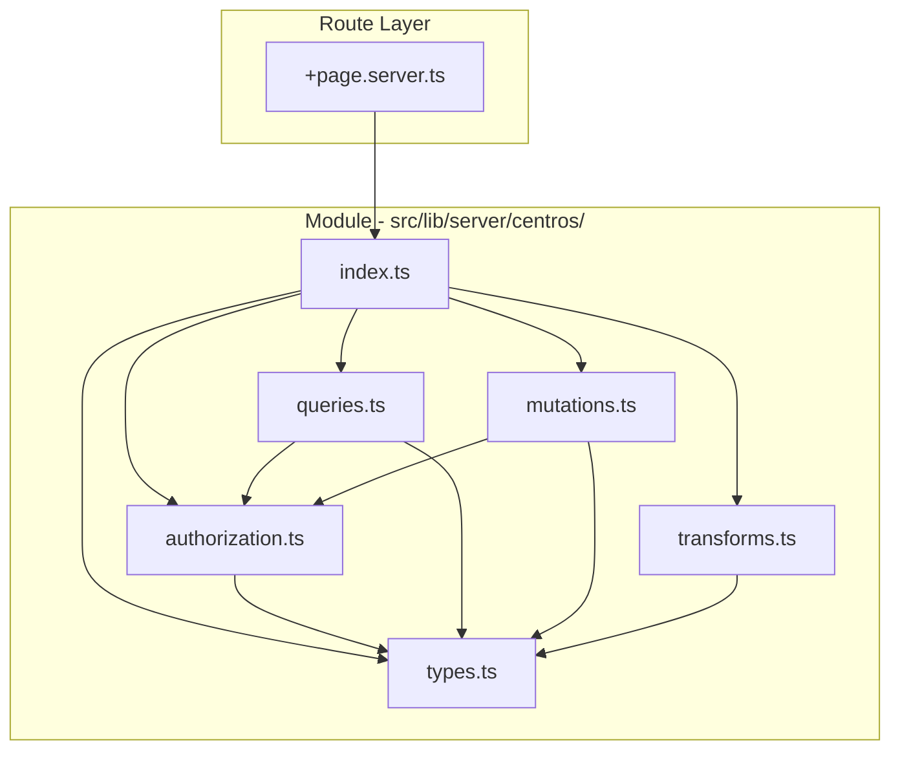

# Diseño de Refactorización: Página de Centros

## 1. Análisis del Archivo Actual

### 1.1 Métricas Generales

| Métrica | Valor |
|---------|-------|
| Archivo | `src/routes/(app)/centros/+page.server.ts` |
| Líneas de código | 156 |
| Funciones | 5 |
| Imports | 7 dependencias |
| Complejidad total estimada | ~25 |

### 1.2 Estructura de Funciones

| Función | Líneas | Descripción | Complejidad Estimada |
|---------|--------|-------------|---------------------|
| [`transformarLugarParaCliente()`](src/routes/(app)/centros/+page.server.ts:14) | 10 | Transforma entidad DB a formato cliente | 2 |
| [`load`](src/routes/(app)/centros/+page.server.ts:26) | 34 | Carga centros con conteo de ciclos | 3 |
| [`actions.create`](src/routes/(app)/centros/+page.server.ts:63) | 27 | Crea nuevo centro de cultivo | 5 |
| [`actions.update`](src/routes/(app)/centros/+page.server.ts:92) | 31 | Actualiza centro existente | 8 |
| [`actions.delete`](src/routes/(app)/centros/+page.server.ts:125) | 31 | Elimina centro sin ciclos | 7 |

### 1.3 Dependencias Actuales

```typescript
// External imports
import { db } from '$lib/server/db';
import { lugares, ciclos } from '$lib/server/db/schema';
import { eq, count, inArray } from 'drizzle-orm';
import { fail } from '@sveltejs/kit';
import { hasMinRole, ROLES, type Rol } from '$lib/server/auth';
import { centroSchema, parseFormData } from '$lib/validations';
```

### 1.4 Puntos de Alta Complejidad Identificados

1. **[`actions.update`](src/routes/(app)/centros/+page.server.ts:92)** - Complejidad 8
   - Mezcla: autenticación, validación, autorización, y lógica de negocio
   - Verifica existencia del centro
   - Verifica permisos con lógica duplicada
   - Construye objeto geom condicionalmente

2. **[`actions.delete`](src/routes/(app)/centros/+page.server.ts:125)** - Complejidad 7
   - Mismo patrón de autorización duplicado
   - Validación adicional: verifica ciclos asociados antes de eliminar

### 1.5 Código Duplicado Identificado

| Patrón Duplicado | Ubicaciones | Líneas |
|------------------|-------------|--------|
| Verificación autenticación | create, update, delete | 3x |
| Verificación permisos (isAdmin OR owner) | update, delete | 2x |
| Construcción de objeto geom | create, update | 2x |
| Verificación existencia centro | update, delete | 2x |

---

## 2. Estructura Modular Propuesta

### 2.1 Diagrama de Arquitectura



### 2.2 Archivos Propuestos

| Archivo | Propósito | Líneas Est. | Complejidad Est. |
|---------|-----------|-------------|------------------|
| `types.ts` | Definiciones de tipos | ~35 | 1 |
| `authorization.ts` | Lógica de permisos | ~40 | 3 |
| `transforms.ts` | Transformaciones de datos | ~25 | 2 |
| `queries.ts` | Consultas DB de lectura | ~45 | 4 |
| `mutations.ts` | Operaciones CRUD | ~65 | 5 |
| `index.ts` | Exports públicos | ~30 | 1 |

**Complejidad total por archivo: todas ≤ 5**

---

## 3. Contenido Propuesto por Archivo

### 3.1 `types.ts` - Definiciones de Tipos

**Responsabilidad**: Centralizar todos los tipos del módulo.

**Contenido propuesto**:

```typescript
/**
 * Tipos específicos del módulo de centros de cultivo.
 */

import type { lugares } from '$lib/server/db/schema';

/** Centro con permisos calculados para la UI */
export type CentroConPermisos = {
	id: number;
	nombre: string;
	latitud: number | null;
	longitud: number | null;
	userId: number;
	createdAt: string | null;
	totalCiclos: number;
	isOwner: boolean;
};

/** Datos del formulario de creación/edición de centro */
export type CentroFormData = {
	nombre: string;
	latitud: number | null;
	longitud: number | null;
};

/** Tipo para punto geométrico PostGIS */
export type GeoPoint = {
	x: number; // longitud
	y: number; // latitud
};

/** Tipo inferido de la tabla lugares */
export type Lugar = typeof lugares.$inferSelect;
```

**Complejidad ciclomática: 1** (solo definiciones de tipos)

---

### 3.2 `authorization.ts` - Lógica de Permisos

**Responsabilidad**: Centralizar toda la lógica de autorización.

**Contenido propuesto**:

```typescript
/**
 * Funciones de autorización para el módulo de centros.
 */

import { hasMinRole, ROLES, type Rol } from '$lib/server/auth';

/**
 * Verifica si el usuario puede ver todos los centros (no solo los propios).
 * ADMIN e INVESTIGADOR pueden ver todos, USUARIO solo los propios.
 */
export function canViewAll(userRol: Rol | undefined): boolean {
	return hasMinRole(userRol, ROLES.INVESTIGADOR);
}

/**
 * Verifica si el usuario puede modificar un centro específico.
 * Un usuario puede modificar si es dueño del centro o si es ADMIN.
 */
export function canModifyCentro(
	centroUserId: number,
	currentUserId: number,
	userRol: Rol
): boolean {
	return centroUserId === currentUserId || userRol === ROLES.ADMIN;
}

/**
 * Verifica si el usuario puede eliminar un centro específico.
 * Un usuario puede eliminar si es dueño del centro o si es ADMIN.
 */
export function canDeleteCentro(
	centroUserId: number,
	currentUserId: number,
	userRol: Rol
): boolean {
	return centroUserId === currentUserId || userRol === ROLES.ADMIN;
}

/**
 * Calcula el flag isOwner para un centro.
 * Es owner si es el creador del centro o si es ADMIN.
 */
export function calculateIsOwner(
	centroUserId: number,
	currentUserId: number,
	userRol: Rol
): boolean {
	return centroUserId === currentUserId || userRol === ROLES.ADMIN;
}
```

**Complejidad ciclomática: 3** (4 funciones, cada una con 1 ternario implícito)

---

### 3.3 `transforms.ts` - Transformaciones de Datos

**Responsabilidad**: Funciones de transformación entre formatos DB y cliente.

**Contenido propuesto**:

```typescript
/**
 * Funciones de transformación para el módulo de centros.
 */

import type { Lugar, CentroConPermisos, GeoPoint } from './types';

/**
 * Transforma un lugar de la DB al formato esperado por el cliente.
 * Extrae latitud/longitud de la columna geom (PostGIS).
 * geom: { x: longitud, y: latitud }
 */
export function transformarLugarParaCliente(lugar: Lugar) {
	return {
		id: lugar.id,
		nombre: lugar.nombre,
		latitud: lugar.geom?.y ?? lugar.latitud ?? null,
		longitud: lugar.geom?.x ?? lugar.longitud ?? null,
		userId: lugar.userId,
		createdAt: lugar.createdAt ? new Date(lugar.createdAt).toISOString() : null
	};
}

/**
 * Construye un punto geométrico para PostGIS si las coordenadas son válidas.
 * Retorna null si alguna coordenada es null/undefined.
 */
export function buildGeoPoint(
	latitud: number | null | undefined,
	longitud: number | null | undefined
): GeoPoint | null {
	return (latitud != null && longitud != null)
		? { x: longitud, y: latitud }
		: null;
}

/**
 * Transforma una lista de lugares con conteo de ciclos y permisos.
 */
export function transformarCentrosConPermisos(
	lugares: Lugar[],
	conteoCiclos: Map<number, number>,
	userId: number,
	userRol: import('$lib/server/auth').Rol
): CentroConPermisos[] {
	const { calculateIsOwner } = await import('./authorization');
	
	return lugares.map((centro) => ({
		...transformarLugarParaCliente(centro),
		totalCiclos: conteoCiclos.get(centro.id) ?? 0,
		isOwner: calculateIsOwner(centro.userId, userId, userRol)
	}));
}
```

**Complejidad ciclomática: 2** (2 ternarios en `transformarLugarParaCliente`, 1 en `buildGeoPoint`)

---

### 3.4 `queries.ts` - Consultas de Lectura

**Responsabilidad**: Todas las consultas de lectura a la base de datos.

**Contenido propuesto**:

```typescript
/**
 * Consultas de lectura para el módulo de centros.
 */

import { db } from '$lib/server/db';
import { lugares, ciclos } from '$lib/server/db/schema';
import { eq, count, inArray } from 'drizzle-orm';
import type { Rol } from '$lib/server/auth';
import { canViewAll } from './authorization';
import type { Lugar } from './types';

/**
 * Obtiene los centros (lugares) accesibles para el usuario.
 * ADMIN e INVESTIGADOR ven todos, USUARIO solo los propios.
 */
export async function getCentrosByUser(userId: number, userRol: Rol): Promise<Lugar[]> {
	return canViewAll(userRol)
		? await db.select().from(lugares)
		: await db.select().from(lugares).where(eq(lugares.userId, userId));
}

/**
 * Obtiene el conteo de ciclos por cada lugar.
 * Retorna un Map con lugarId -> total ciclos.
 */
export async function getCiclosCountByLugares(lugarIds: number[]): Promise<Map<number, number>> {
	if (lugarIds.length === 0) {
		return new Map();
	}

	const ciclosPorLugar = await db
		.select({ lugarId: ciclos.lugarId, total: count() })
		.from(ciclos)
		.where(inArray(ciclos.lugarId, lugarIds))
		.groupBy(ciclos.lugarId);

	return new Map(ciclosPorLugar.map((c) => [c.lugarId, c.total]));
}

/**
 * Obtiene un centro por su ID.
 */
export async function getCentroById(centroId: number): Promise<Lugar | undefined> {
	const [centro] = await db
		.select()
		.from(lugares)
		.where(eq(lugares.id, centroId))
		.limit(1);
	
	return centro;
}

/**
 * Cuenta los ciclos asociados a un lugar específico.
 */
export async function countCiclosByLugar(lugarId: number): Promise<number> {
	const [result] = await db
		.select({ total: count() })
		.from(ciclos)
		.where(eq(ciclos.lugarId, lugarId))
		.limit(1);

	return result?.total ?? 0;
}
```

**Complejidad ciclomática: 4** (1 ternario en `getCentrosByUser`, 1 if en `getCiclosCountByLugares`, 1 nullish coalescing en `countCiclosByLugar`)

---

### 3.5 `mutations.ts` - Operaciones CRUD

**Responsabilidad**: Todas las operaciones de escritura a la base de datos.

**Contenido propuesto**:

```typescript
/**
 * Operaciones de escritura (CRUD) para el módulo de centros.
 */

import { db } from '$lib/server/db';
import { lugares } from '$lib/server/db/schema';
import { eq } from 'drizzle-orm';
import type { Rol } from '$lib/server/auth';
import { canModifyCentro, canDeleteCentro } from './authorization';
import { getCentroById, countCiclosByLugar } from './queries';
import { buildGeoPoint } from './transforms';
import type { CentroFormData } from './types';

/**
 * Crea un nuevo centro de cultivo.
 */
export async function createCentro(
	data: CentroFormData,
	userId: number
): Promise<void> {
	const geom = buildGeoPoint(data.latitud, data.longitud);

	await db.insert(lugares).values({
		nombre: data.nombre,
		geom,
		userId
	});
}

/**
 * Actualiza un centro existente.
 * Retorna error si no tiene permisos.
 */
export async function updateCentro(
	centroId: number,
	data: CentroFormData,
	userId: number,
	userRol: Rol
): Promise<{ success: true } | { success: false; error: string; status: number }> {
	const centro = await getCentroById(centroId);
	
	if (!centro) {
		return { success: false, error: 'Centro no encontrado', status: 404 };
	}

	if (!canModifyCentro(centro.userId, userId, userRol)) {
		return { success: false, error: 'No tiene permisos para editar este centro', status: 403 };
	}

	const geom = buildGeoPoint(data.latitud, data.longitud);

	await db
		.update(lugares)
		.set({ nombre: data.nombre, geom })
		.where(eq(lugares.id, centroId));

	return { success: true };
}

/**
 * Elimina un centro.
 * Retorna error si no tiene permisos o tiene ciclos asociados.
 */
export async function deleteCentro(
	centroId: number,
	userId: number,
	userRol: Rol
): Promise<{ success: true } | { success: false; error: string; status: number }> {
	const centro = await getCentroById(centroId);
	
	if (!centro) {
		return { success: false, error: 'Centro no encontrado', status: 404 };
	}

	if (!canDeleteCentro(centro.userId, userId, userRol)) {
		return { success: false, error: 'No tiene permisos para eliminar este centro', status: 403 };
	}

	const ciclosCount = await countCiclosByLugar(centroId);
	
	if (ciclosCount > 0) {
		return { success: false, error: 'No se puede eliminar un centro con ciclos asociados', status: 400 };
	}

	await db.delete(lugares).where(eq(lugares.id, centroId));

	return { success: true };
}
```

**Complejidad ciclomática: 5** (2 ifs en updateCentro, 3 ifs en deleteCentro)

---

### 3.6 `index.ts` - Exports Públicos

**Responsabilidad**: Punto de entrada único para el módulo.

**Contenido propuesto**:

```typescript
/**
 * Módulo de centros de cultivo.
 * Punto de entrada público que re-exporta todos los submódulos.
 */

// Tipos
export type {
	CentroConPermisos,
	CentroFormData,
	GeoPoint,
	Lugar
} from './types';

// Autorización
export {
	canViewAll,
	canModifyCentro,
	canDeleteCentro,
	calculateIsOwner
} from './authorization';

// Transformaciones
export {
	transformarLugarParaCliente,
	buildGeoPoint,
	transformarCentrosConPermisos
} from './transforms';

// Consultas
export {
	getCentrosByUser,
	getCiclosCountByLugares,
	getCentroById,
	countCiclosByLugar
} from './queries';

// Mutaciones
export {
	createCentro,
	updateCentro,
	deleteCentro
} from './mutations';
```

**Complejidad ciclomática: 1** (solo exports)

---

## 4. Archivo Route Actualizado

Después de la refactorización, el archivo [`+page.server.ts`](src/routes/(app)/centros/+page.server.ts) quedaría así:

```typescript
import type { PageServerLoad, Actions } from './$types';
import { fail } from '@sveltejs/kit';
import { centroSchema, parseFormData } from '$lib/validations';
import type { Rol } from '$lib/server/auth';
import {
	canViewAll,
	getCentrosByUser,
	getCiclosCountByLugares,
	transformarCentrosConPermisos,
	createCentro,
	updateCentro,
	deleteCentro
} from '$lib/server/centros';

export const load: PageServerLoad = async ({ locals }) => {
	const userId = locals.user?.userId;
	const userRol = locals.user?.rol as Rol;

	const centrosList = await getCentrosByUser(userId!, userRol);
	const lugarIds = centrosList.map((c) => c.id);
	const conteoCiclos = await getCiclosCountByLugares(lugarIds);

	const centros = transformarCentrosConPermisos(
		centrosList,
		conteoCiclos,
		userId!,
		userRol
	);

	return {
		centros,
		canViewAll: canViewAll(userRol)
	};
};

export const actions = {
	create: async ({ request, locals }) => {
		const userId = locals.user?.userId;
		if (!userId) return fail(401, { error: true, message: 'No autenticado' });

		const formData = await request.formData();
		const validated = await parseFormData(centroSchema, formData);
		
		if (!validated.success) {
			return validated.response;
		}

		await createCentro(validated.data, userId);
		return { success: true, message: 'Centro creado exitosamente' };
	},

	update: async ({ request, locals }) => {
		const userId = locals.user?.userId;
		if (!userId) return fail(401, { error: true, message: 'No autenticado' });

		const formData = await request.formData();
		const centroId = Number(formData.get('centroId'));

		const validated = await parseFormData(centroSchema, formData);
		if (!validated.success) return validated.response;

		const result = await updateCentro(
			centroId,
			validated.data,
			userId,
			locals.user?.rol as Rol
		);

		if (!result.success) {
			return fail(result.status, { error: true, message: result.error });
		}

		return { success: true, message: 'Centro actualizado exitosamente' };
	},

	delete: async ({ request, locals }) => {
		const userId = locals.user?.userId;
		if (!userId) return fail(401, { error: true, message: 'No autenticado' });

		const data = await request.formData();
		const centroId = Number(data.get('centroId'));

		const result = await deleteCentro(
			centroId,
			userId,
			locals.user?.rol as Rol
		);

		if (!result.success) {
			return fail(result.status, { error: true, message: result.error });
		}

		return { success: true, message: 'Centro eliminado exitosamente' };
	}
} satisfies Actions;
```

**Complejidad estimada del archivo refactorizado: 8**

---

## 5. Resumen de Complejidad

### 5.1 Antes vs Después

| Métrica | Antes | Después | Mejora |
|---------|-------|---------|--------|
| Líneas en route | 156 | ~60 | -62% |
| Complejidad total | ~25 | ~16 en módulo + 8 en route | Distribuida |
| Función más compleja | 8 (update) | 5 (mutations) | -37% |
| Archivos con Cc > 10 | 1 | 0 | ✅ |

### 5.2 Complejidad por Archivo Propuesto

| Archivo | Complejidad | Cumple ≤10 |
|---------|-------------|------------|
| `types.ts` | 1 | ✅ |
| `authorization.ts` | 3 | ✅ |
| `transforms.ts` | 2 | ✅ |
| `queries.ts` | 4 | ✅ |
| `mutations.ts` | 5 | ✅ |
| `index.ts` | 1 | ✅ |
| `+page.server.ts` | 8 | ✅ |

---

## 6. Dependencias Entre Archivos

```mermaid
graph LR
    subgraph External
        DB[db - schema]
        AUTH[auth - ROLES, Rol]
        VAL[validations]
        SK[@sveltejs/kit]
    end

    subgraph Module
        IDX[index.ts]
        TYP[types.ts]
        AUTHM[authorization.ts]
        TRF[transforms.ts]
        QRY[queries.ts]
        MUT[mutations.ts]
    end

    TYP --> DB
    AUTHM --> AUTH
    TRF --> TYP
    TRF --> AUTHM
    QRY --> DB
    QRY --> TYP
    QRY --> AUTHM
    MUT --> DB
    MUT --> TYP
    MUT --> AUTHM
    MUT --> QRY
    MUT --> TRF
    IDX --> TYP
    IDX --> AUTHM
    IDX --> TRF
    IDX --> QRY
    IDX --> MUT
```

---

## 7. Recomendaciones de Implementación

### 7.1 Orden de Creación

1. **Crear directorio**: `src/lib/server/centros/`
2. **Crear archivos en orden**:
   - `types.ts` (sin dependencias internas)
   - `authorization.ts` (depende solo de auth externo)
   - `transforms.ts` (depende de types)
   - `queries.ts` (depende de types y authorization)
   - `mutations.ts` (depende de todos los anteriores)
   - `index.ts` (exports)

3. **Actualizar route**: Modificar `+page.server.ts` para usar el módulo

### 7.2 Validaciones

- [ ] Verificar que todos los tests existentes pasen
- [ ] Verificar comportamiento en browser (load, create, update, delete)
- [ ] Verificar permisos por rol (ADMIN, INVESTIGADOR, USUARIO)
- [ ] Verificar que la lógica de PostGIS geom funcione correctamente

### 7.3 Consideraciones Adicionales

1. **Sin seeds.ts**: A diferencia de registros, centros no requiere datos semilla iniciales.

2. **Reutilización**: El módulo podrá ser importado desde otros lugares (ej: dashboard, reportes).

3. **Testabilidad**: Cada función puede testearse de forma aislada.

4. **Mantenibilidad**: Cambios en permisos o queries se centralizan en un archivo.

---

## 8. Supuestos y Riesgos

### Supuestos
- El comportamiento actual es correcto y debe preservarse
- La estructura de permisos (ADMIN/INVESTIGADOR/USUARIO) no cambiará
- El esquema de base de datos (`lugares`, `ciclos`) es estable

### Riesgos
- **Bajo**: Función `transformarCentrosConPermisos` con import dinámico puede causar issues de bundling. Alternativa: mover la importación al tope del archivo.

### Vacíos de Información
- No hay tests unitarios existentes para centros. Se recomienda crearlos junto con la refactorización.

---

## 9. Checklist de Implementación

- [ ] Crear `src/lib/server/centros/types.ts`
- [ ] Crear `src/lib/server/centros/authorization.ts`
- [ ] Crear `src/lib/server/centros/transforms.ts`
- [ ] Crear `src/lib/server/centros/queries.ts`
- [ ] Crear `src/lib/server/centros/mutations.ts`
- [ ] Crear `src/lib/server/centros/index.ts`
- [ ] Refactorizar `src/routes/(app)/centros/+page.server.ts`
- [ ] Ejecutar tests existentes
- [ ] Verificar comportamiento manualmente
- [ ] Crear tests unitarios para el nuevo módulo (opcional pero recomendado)