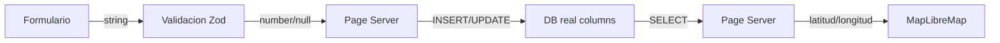
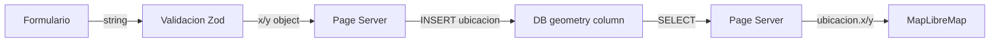
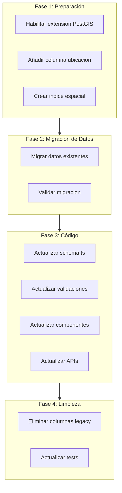

# Diseño de Migración a PostGIS para Coordenadas

## 1. Estado Actual

### 1.1 Schema de Base de Datos

La tabla [`lugares`](../src/lib/server/db/schema.ts:62) almacena coordenadas con dos columnas separadas:

```typescript
export const lugares = pgTable('lugares', {
  id: serial('id').primaryKey(),
  nombre: text('nombre').notNull(),
  latitud: real('latitud'),  // float 32 bits, ~7 dígitos decimales
  longitud: real('longitud'),
  userId: integer('user_id').notNull().references(() => usuarios.id),
  createdAt: timestamp('created_at').defaultNow()
});
```

**Limitaciones actuales:**
- Tipo `real` (float 32 bits) con precisión de ~7 dígitos decimales (~11mm)
- Sin índice espacial para consultas geográficas
- Sin funciones nativas para cálculos de distancia o área
- Separación de latitud/longitud dificulta operaciones espaciales

### 1.2 Consumo en Frontend

El componente [`MapLibreMap.svelte`](../src/lib/components/MapLibreMap.svelte:8) espera coordenadas en formato:

```typescript
// Props de entrada
latitude?: number;   // Latitud (Y)
longitude?: number;  // Longitud (X)

// Evento de salida onselect
onselect?: (data: { lat: number; lng: number }) => void;

// Centro del mapa
center={[longitude, latitude]}  // Orden: [lng, lat]
```

**Convención MapLibre/GeoJSON:**
- Coordenadas en orden `[longitud, latitud]` (X, Y)
- SRID implícito 4326 (WGS84)

### 1.3 Flujo de Datos Actual



### 1.4 Archivos que Manejan Coordenadas

| Archivo | Uso |
|---------|-----|
| [`src/lib/server/db/schema.ts`](../src/lib/server/db/schema.ts:65) | Definición de columnas latitud/longitud |
| [`src/lib/validations/index.ts`](../src/lib/validations/index.ts:15) | Validación de rangos lat/lng |
| [`src/routes/(app)/centros/+page.server.ts`](../src/routes/(app)/centros/+page.server.ts:59) | Crear/editar lugares |
| [`src/routes/(app)/investigador/centros/+page.server.ts`](../src/routes/(app)/investigador/centros/+page.server.ts:17) | Listar lugares investigador |
| [`src/routes/api/export-data/+server.ts`](../src/routes/api/export-data/+server.ts:63) | Exportación Excel |
| [`src/lib/components/centros/CentroCreateForm.svelte`](../src/lib/components/centros/CentroCreateForm.svelte:86) | Formulario creación |
| [`src/lib/components/centros/CentroRow.svelte`](../src/lib/components/centros/CentroRow.svelte:104) | Fila edición/lista |
| [`src/routes/(app)/centros/+page.svelte`](../src/routes/(app)/centros/+page.svelte:98) | Columnas datagrid |
| [`src/routes/(app)/investigador/centros/+page.svelte`](../src/routes/(app)/investigador/centros/+page.svelte:53) | Columnas datagrid investigador |

---

## 2. Arquitectura Propuesta

### 2.1 Tipo de Dato PostGIS

**Decisión: `geometry(Point, 4326)`**

| Opción | Ventajas | Desventajas |
|--------|----------|-------------|
| `geometry(Point, 4326)` | Compatible con GeoJSON, soporte completo de funciones, índices GIST eficientes | Requiere convertir a metros para distancias precisas |
| `geography(Point, 4326)` | Cálculos en metros automáticamente | Menos funciones disponibles, mayor overhead |

**Justificación:** Se elige `geometry` porque:
1. MapLibre espera formato GeoJSON nativo
2. Mayor compatibilidad con herramientas GIS
3. SRID 4326 es estándar para coordenadas geográficas web
4. Drizzle ORM tiene soporte nativo para `geometry`

### 2.2 SRID: 4326 (WGS84)

- Estándar para GPS y aplicaciones web
- Usado por MapLibre, Google Maps, OpenStreetMap
- Coordenadas en grados decimales

### 2.3 Schema Propuesto

```typescript
import { geometry, index, pgTable, serial, text, timestamp, integer } from 'drizzle-orm/pg-core';

export const lugares = pgTable(
  'lugares',
  {
    id: serial('id').primaryKey(),
    nombre: text('nombre').notNull(),
    // Columna PostGIS - almacena punto geográfico
    ubicacion: geometry('ubicacion', { 
      type: 'point', 
      mode: 'xy',    // Devuelve { x: number, y: number }
      srid: 4326 
    }),
    // Columnas legacy - mantener durante migración, luego eliminar
    latitud: real('latitud'),
    longitud: real('longitud'),
    userId: integer('user_id').notNull().references(() => usuarios.id),
    createdAt: timestamp('created_at').defaultNow()
  },
  (table) => [
    index('lugares_ubicacion_idx').using('gist', table.ubicacion)
  ]
);
```

### 2.4 Tipo TypeScript

```typescript
// Tipo para coordenadas PostGIS
export type PuntoGeografico = { x: number; y: number } | null;

// x = longitud, y = latitud
// Ejemplo: { x: -72.9411, y: -41.4689 }
```

### 2.5 Flujo de Datos Propuesto



---

## 3. Estrategia de Migración

### 3.1 Fases de Migración



### 3.2 Scripts de Migración SQL

#### Fase 1: Habilitar PostGIS y añadir columna

```sql
-- 0004_add_postgis_extension.sql
CREATE EXTENSION IF NOT EXISTS postgis;

-- Añadir columna geometry
ALTER TABLE lugares ADD COLUMN ubicacion geometry(Point, 4326);

-- Crear índice espacial
CREATE INDEX lugares_ubicacion_idx ON lugares USING GIST (ubicacion);
```

#### Fase 2: Migrar datos existentes

```sql
-- 0005_migrate_coordinates_to_postgis.sql
-- Migrar coordenadas existentes a columna geometry
UPDATE lugares 
SET ubicacion = ST_SetSRID(ST_MakePoint(longitud, latitud), 4326)
WHERE latitud IS NOT NULL AND longitud IS NOT NULL;
```

#### Fase 4: Eliminar columnas legacy (después de validar)

```sql
-- 0006_drop_legacy_coordinates.sql (ejecutar tras validación completa)
ALTER TABLE lugares DROP COLUMN latitud;
ALTER TABLE lugares DROP COLUMN longitud;
```

---

## 4. Cambios en API

### 4.1 Serialización de Respuestas

**Problema:** PostGIS devuelve formato interno, necesitamos exponer coordenadas legibles.

**Solución:** Transformar en el server antes de enviar al cliente.

```typescript
// Helper de transformación
function transformarLugarParaCliente(lugar: LugarDB): LugarCliente {
  return {
    id: lugar.id,
    nombre: lugar.nombre,
    latitud: lugar.ubicacion?.y ?? null,  // y = latitud
    longitud: lugar.ubicacion?.x ?? null, // x = longitud
    userId: lugar.userId,
    createdAt: lugar.createdAt
  };
}
```

### 4.2 Inserción de Datos

**Antes:**
```typescript
await db.insert(lugares).values({
  nombre,
  latitud: latitud ?? null,
  longitud: longitud ?? null,
  userId
});
```

**Después:**
```typescript
import { sql } from 'drizzle-orm';

await db.insert(lugares).values({
  nombre,
  ubicacion: latitud != null && longitud != null 
    ? sql`ST_SetSRID(ST_MakePoint(${longitud}, ${latitud}), 4326)`
    : null,
  userId
});
```

**Alternativa con modo 'xy':**
```typescript
await db.insert(lugares).values({
  nombre,
  ubicacion: latitud != null && longitud != null 
    ? { x: longitud, y: latitud }
    : null,
  userId
});
```

### 4.3 Endpoints Afectados

| Endpoint | Cambio |
|----------|--------|
| `POST ?/create` (centros) | Usar columna `ubicacion` |
| `POST ?/edit` (centros) | Usar columna `ubicacion` |
| `GET /api/export-data` | Extraer lat/lng de `ubicacion` |

---

## 5. Cambios en Frontend

### 5.1 Componentes que Requieren Cambios

#### CentroCreateForm.svelte
- Sin cambios en UI
- Mantener campos separados lat/lng para UX
- Backend transforma a PostGIS

#### CentroRow.svelte
- Sin cambios en UI
- Leer de `ubicacion.x` / `ubicacion.y`

#### MapLibreMap.svelte
- Sin cambios
- Sigue recibiendo `latitude`/`longitude` como props

### 5.2 Formato de Datos entre Server y Cliente

**El frontend NO necesita cambios significativos.** El server transforma:

```typescript
// Server envía al cliente
{
  id: 1,
  nombre: "Centro Calbuco",
  latitud: -41.4689,   // Extraído de ubicacion.y
  longitud: -72.9411   // Extraído de ubicacion.x
}

// Cliente envía al server
{ nombre: "Nuevo Centro", latitud: -41.5, longitud: -72.9 }
```

---

## 6. Lista de Archivos a Modificar

### 6.1 Base de Datos (migraciones)

| Archivo | Acción |
|---------|--------|
| `drizzle/0004_add_postgis.sql` | CREAR - Habilitar extensión y columna |
| `drizzle/0005_migrate_coordinates.sql` | CREAR - Migrar datos |
| `drizzle/0006_drop_legacy_columns.sql` | CREAR - Eliminar columnas old (fase final) |
| `drizzle/meta/_journal.json` | ACTUALIZAR - Registrar migraciones |

### 6.2 Schema y Types

| Archivo | Cambio |
|---------|--------|
| `src/lib/server/db/schema.ts` | Añadir columna `ubicacion geometry`, mantener `latitud`/`longitud` temporalmente |

### 6.3 Validaciones

| Archivo | Cambio |
|---------|--------|
| `src/lib/validations/index.ts` | Mantener validación actual, añadir helper de transformación |

### 6.4 Server Routes

| Archivo | Cambio |
|---------|--------|
| `src/routes/(app)/centros/+page.server.ts` | Usar `ubicacion` en INSERT/UPDATE, transformar en SELECT |
| `src/routes/(app)/investigador/centros/+page.server.ts` | Transformar `ubicacion` a `latitud`/`longitud` |
| `src/routes/api/export-data/+server.ts` | Extraer coordenadas de `ubicacion` |

### 6.5 Componentes

| Archivo | Cambio |
|---------|--------|
| `src/lib/components/centros/CentroRow.svelte` | Leer de `centro.ubicacion?.x/y` o mantener props transformadas |

### 6.6 Tests

| Archivo | Cambio |
|---------|--------|
| `src/lib/validations/index.test.ts` | Sin cambios (validación igual) |
| `src/lib/components/centros/CentroCreateForm.svelte.test.ts` | Sin cambios |
| `src/lib/components/centros/CentroRow.svelte.test.ts` | Actualizar mock de datos |
| `src/__tests__/api/centros/centros.test.ts` | Actualizar mocks |
| `src/__tests__/api/export-data/export-data.test.ts` | Actualizar mocks |

---

## 7. Supuestos y Riesgos

### 7.1 Supuestos

1. **PostgreSQL soporta PostGIS** - La base de datos (Neon) tiene la extensión disponible
2. **Drizzle ORM versión soporta geometry** - Se usa drizzle-orm ^0.45.1 que incluye soporte PostGIS
3. **No hay datos inválidos** - Los datos existentes tienen coordenadas válidas o null
4. **SRID 4326 es suficiente** - No se requieren proyecciones locales

### 7.2 Riesgos

| Riesgo | Mitigación |
|--------|------------|
| Extensión PostGIS no disponible en Neon | Verificar con `SELECT PostGIS_Version()` antes de migrar |
| Datos con coordenadas inválidas | Validar antes de migrar con query de sanity check |
| Regresión en funcionalidad existente | Ejecutar todos los tests antes de eliminar columnas legacy |
| Problemas de precisión en migración | Comparar coordenadas antes/después con tolerancia |

### 7.3 Dependencias Pendientes

- [ ] Verificar que Neon PostgreSQL tiene PostGIS habilitado
- [ ] Confirmar versión mínima de Drizzle ORM para geometry

---

## 8. Plan de Tareas para Implementación

```markdown
- [ ] **Fase 1: Preparación DB**
  - [ ] Verificar PostGIS disponible en Neon
  - [ ] Crear migración 0004_add_postgis_extension.sql
  - [ ] Ejecutar migración
  - [ ] Verificar columna ubicacion creada

- [ ] **Fase 2: Migración de Datos**
  - [ ] Crear migración 0005_migrate_coordinates.sql
  - [ ] Ejecutar migración
  - [ ] Validar datos migrados con query de verificación

- [ ] **Fase 3: Actualización de Código**
  - [ ] Actualizar schema.ts con columna geometry
  - [ ] Añadir helper transformarLugarParaCliente()
  - [ ] Actualizar centros/+page.server.ts
  - [ ] Actualizar investigador/centros/+page.server.ts
  - [ ] Actualizar api/export-data/+server.ts
  - [ ] Actualizar tests afectados

- [ ] **Fase 4: Validación**
  - [ ] Ejecutar suite de tests completa
  - [ ] Validar en desarrollo: crear, editar, listar
  - [ ] Validar exportación Excel
  - [ ] Validar visualización en mapa

- [ ] **Fase 5: Limpieza** (opcional, tras validación)
  - [ ] Crear migración 0006_drop_legacy_columns.sql
  - [ ] Eliminar columnas latitud/longitud de schema.ts
  - [ ] Actualizar referencias en código
```

---

## 9. Consultas Útiles PostGIS

### Verificar extensión
```sql
SELECT PostGIS_Version();
```

### Ver datos migrados
```sql
SELECT 
  id, 
  nombre, 
  latitud, 
  longitud,
  ST_AsText(ubicacion) as ubicacion_wkt,
  ST_X(ubicacion) as calc_longitud,
  ST_Y(ubicacion) as calc_latitud
FROM lugares
WHERE ubicacion IS NOT NULL;
```

### Validar migración
```sql
-- Verificar que las coordenadas coinciden
SELECT id, nombre
FROM lugares
WHERE latitud IS NOT NULL 
  AND longitud IS NOT NULL
  AND (
    ABS(ST_Y(ubicacion) - latitud) > 0.0001 
    OR ABS(ST_X(ubicacion) - longitud) > 0.0001
  );
```

### Consulta de distancia (ejemplo futuro)
```sql
-- Lugares dentro de 10km de un punto
SELECT id, nombre, 
  ST_Distance(ubicacion, ST_MakePoint(-72.9411, -41.4689)::geography) / 1000 as distancia_km
FROM lugares
WHERE ST_DWithin(ubicacion::geography, ST_MakePoint(-72.9411, -41.4689)::geography, 10000)
ORDER BY distancia_km;