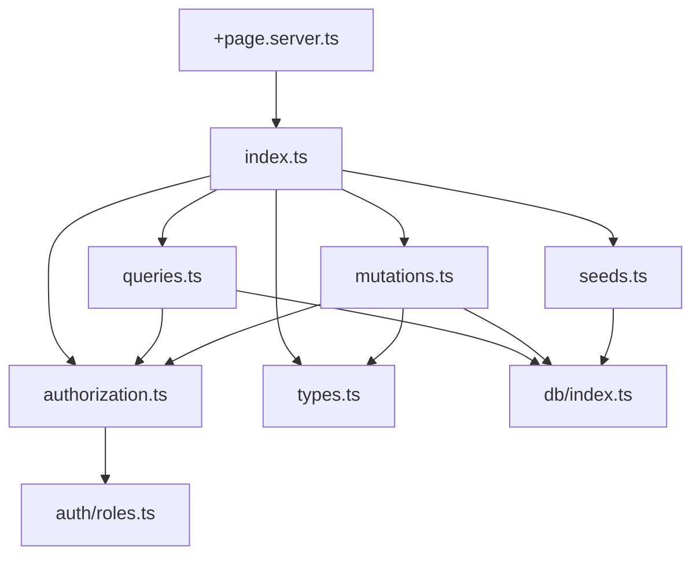

# Diseño de Refactorización: `+page.server.ts` de Registros

## 1. Análisis del Archivo Actual

### 1.1 Métricas Generales

| Métrica | Valor |
|---------|-------|
| Líneas de código | 188 |
| Complejidad ciclomática | **26** |
| Límite configurado | 10 |
| Exceso | +160% |

### 1.2 Estructura del Archivo

El archivo [`+page.server.ts`](src/routes/(app)/registros/+page.server.ts) contiene:

1. **Función `load`** (líneas 9-84): Carga datos iniciales para la página
2. **Objeto `actions`** con 3 acciones:
   - `create` (líneas 87-118): Crea un nuevo registro de medición
   - `update` (líneas 121-160): Actualiza un registro existente
   - `delete` (líneas 163-187): Elimina un registro

### 1.3 Análisis de Complejidad por Función

#### Función `load` - Complejidad estimada: **12**

| Elemento | Contribución |
|----------|--------------|
| Función base | 1 |
| `hasMinRole` (línea 15) | +1 |
| `hasMinRole` (línea 19) | +1 |
| `if origenes.length === 0` (línea 27) | +1 |
| `hasMinRole` (línea 64) | +1 |
| `if !hasMinRole` (línea 64) | +1 |
| `registros.map` con condición `isOwner` (línea 72-75) | +1 |
| Múltiples llamadas a DB condicionales | +5 |
| **Total** | **12** |

#### Acción `create` - Complejidad estimada: **5**

| Elemento | Contribución |
|----------|--------------|
| Función base | 1 |
| `if !userId` (línea 89) | +1 |
| `if !lugarId || ...` (línea 100) | +1 |
| `try/catch` (líneas 104-118) | +1 |
| Condiciones implícitas en parsing | +1 |
| **Total** | **5** |

#### Acción `update` - Complejidad estimada: **7**

| Elemento | Contribución |
|----------|--------------|
| Función base | 1 |
| `if !userId` (línea 124) | +1 |
| `if !id` (línea 130) | +1 |
| `if !validated.success` (línea 133) | +1 |
| `if userRol === ROLES.ADMIN` (línea 149) | +1 |
| `else` (línea 151) | +1 |
| `try/catch` (líneas 138-160) | +1 |
| **Total** | **7** |

#### Acción `delete` - Complejidad estimada: **6**

| Elemento | Contribución |
|----------|--------------|
| Función base | 1 |
| `if !userId` (línea 166) | +1 |
| `if !id` (línea 171) | +1 |
| `if userRol === ROLES.ADMIN` (línea 174) | +1 |
| `else` (línea 177) | +1 |
| `try/catch` (líneas 173-186) | +1 |
| **Total** | **6** |

### 1.4 Responsabilidades Identificadas

1. **Carga de datos maestros**: centros, ciclos, tipos, orígenes
2. **Lógica de autorización**: filtrado por rol, propiedad
3. **Semilla de datos**: inserción de orígenes si no existen
4. **Consulta de registros**: join complejo con múltiples tablas
5. **Transformación de datos**: agregar campo `isOwner`
6. **CRUD de mediciones**: create, update, delete
7. **Validación de formularios**: parseo y validación

### 1.5 Código Duplicado Detectado

El reporte indica **11 líneas duplicadas 4 veces** en archivos `+page.server.ts`. Patrones repetidos:

- Verificación de autenticación: `if (!userId) return fail(401, ...)`
- Verificación de permisos: `if (userRol === ROLES.ADMIN) ... else ...`
- Manejo de errores: `try { ... } catch { return fail(500, ...) }`

---

## 2. Propuesta de Estructura Modular

### 2.1 Principios de Diseño

1. **Separación por dominio**: Un módulo por entidad principal
2. **Responsabilidad única**: Cada archivo con un propósito claro
3. **Reutilización**: Funciones compartidas en módulos comunes
4. **Compatibilidad SvelteKit**: Mantener exports requeridos en `+page.server.ts`

### 2.2 Estructura de Archivos Propuesta

```
src/lib/server/registros/
├── index.ts              # Exports públicos del módulo
├── types.ts              # Tipos específicos del dominio
├── queries.ts            # Consultas a base de datos
├── mutations.ts          # Operaciones de escritura (create/update/delete)
├── authorization.ts      # Lógica de permisos y autorización
└── seeds.ts              # Datos iniciales (orígenes)
```

### 2.3 Contenido de Cada Archivo

#### [`src/lib/server/registros/types.ts`](src/lib/server/registros/types.ts)

**Propósito**: Definiciones de tipos específicas del dominio registros.

```typescript
// Tipos para el módulo de registros
export type RegistroConPermisos = {
  id: number;
  valor: number;
  fechaMedicion: Date;
  notas: string | null;
  centroId: number;
  centroNombre: string;
  cicloId: number | null;
  cicloNombre: string | null;
  tipoId: number;
  tipoNombre: string;
  unidad: string | null;
  origenNombre: string;
  userId: number;
  isOwner: boolean;
};

export type RegistroFormData = {
  lugarId: number;
  cicloId: number | null;
  tipoId: number;
  origenId: number;
  valor: number;
  fechaMedicion: string;
  notas: string;
};
```

**Complejidad estimada**: 1 (solo definiciones de tipos)

---

#### [`src/lib/server/registros/authorization.ts`](src/lib/server/registros/authorization.ts)

**Propósito**: Funciones de autorización reutilizables.

```typescript
// Funciones de autorización
export function canViewAll(userRol: Rol): boolean {
  return hasMinRole(userRol, ROLES.INVESTIGADOR);
}

export function canModifyRegistro(
  registroUserId: number,
  currentUserId: number,
  userRol: Rol
): boolean {
  return registroUserId === currentUserId || userRol === ROLES.ADMIN;
}

export function requireAuth(userId: number | undefined): asserts userId is number {
  if (!userId) {
    throw error(401, 'No autenticado');
  }
}
```

**Complejidad estimada**: 3

---

#### [`src/lib/server/registros/seeds.ts`](src/lib/server/registros/seeds.ts)

**Propósito**: Lógica de datos iniciales.

```typescript
// Semilla de orígenes de datos
const ORIGENES_INICIALES = [
  { nombre: 'Manual / Terreno' },
  { nombre: 'Laboratorio' },
  { nombre: 'Satelital' },
  { nombre: 'Sensor IoT' },
  { nombre: 'PSMB' }
];

export async function ensureOrigenesSeed(): Promise<typeof origenDatos.$inferSelect[]> {
  let origenes = await db.select().from(origenDatos);
  if (origenes.length === 0) {
    await db.insert(origenDatos).values(ORIGENES_INICIALES);
    origenes = await db.select().from(origenDatos);
  }
  return origenes;
}
```

**Complejidad estimada**: 2

---

#### [`src/lib/server/registros/queries.ts`](src/lib/server/registros/queries.ts)

**Propósito**: Consultas de lectura a la base de datos.

```typescript
// Consultas para el módulo de registros
export async function getCentrosByUser(userId: number, userRol: Rol) {
  return hasMinRole(userRol, ROLES.INVESTIGADOR)
    ? await db.select().from(lugares)
    : await db.select().from(lugares).where(eq(lugares.userId, userId));
}

export async function getCiclosByUser(userId: number, userRol: Rol) {
  return hasMinRole(userRol, ROLES.INVESTIGADOR)
    ? await db.select().from(ciclos)
    : await db.select().from(ciclos).where(eq(ciclos.userId, userId));
}

export async function getTiposRegistro() {
  return db.select().from(tiposRegistro);
}

export async function getRegistrosWithPermisos(userId: number, userRol: Rol) {
  // ... lógica de consulta con joins
}

export async function getRegistroById(id: number) {
  // ... consulta individual
}
```

**Complejidad estimada**: 6

---

#### [`src/lib/server/registros/mutations.ts`](src/lib/server/registros/mutations.ts)

**Propósito**: Operaciones de escritura (CRUD).

```typescript
// Mutaciones para el módulo de registros
export async function createRegistro(data: RegistroFormData, userId: number) {
  // ... lógica de creación
}

export async function updateRegistro(
  id: number,
  data: RegistroFormData,
  userId: number,
  userRol: Rol
) {
  // ... lógica de actualización con permisos
}

export async function deleteRegistro(id: number, userId: number, userRol: Rol) {
  // ... lógica de eliminación con permisos
}
```

**Complejidad estimada**: 8

---

#### [`src/lib/server/registros/index.ts`](src/lib/server/registros/index.ts)

**Propósito**: Exportar API pública del módulo.

```typescript
// Re-exports públicos
export * from './types';
export * from './queries';
export * from './mutations';
export * from './authorization';
export * from './seeds';
```

**Complejidad estimada**: 1

---

#### [`src/routes/(app)/registros/+page.server.ts`](src/routes/(app)/registros/+page.server.ts) (Refactorizado)

**Propósito**: Punto de entrada SvelteKit, orquesta los módulos.

```typescript
import type { PageServerLoad, Actions } from './$types';
import {
  getCentrosByUser,
  getCiclosByUser,
  getTiposRegistro,
  getRegistrosWithPermisos,
  createRegistro,
  updateRegistro,
  deleteRegistro,
  ensureOrigenesSeed,
  canViewAll
} from '$lib/server/registros';
import { fail } from '@sveltejs/kit';
import type { Rol } from '$lib/server/auth';

export const load: PageServerLoad = async ({ locals }) => {
  const userRol = locals.user?.rol as Rol;
  const userId = locals.user?.userId as number;

  const [centros, ciclos, tipos, origenes, registros] = await Promise.all([
    getCentrosByUser(userId, userRol),
    getCiclosByUser(userId, userRol),
    getTiposRegistro(),
    ensureOrigenesSeed(),
    getRegistrosWithPermisos(userId, userRol)
  ]);

  return { centros, ciclos, tipos, origenes, registros };
};

export const actions = {
  create: async ({ request, locals }) => {
    const userId = locals.user?.userId as number;
    if (!userId) return fail(401, { error: true, message: 'No autenticado' });

    const formData = await request.formData();
    // ... validación y llamada a createRegistro
  },

  update: async ({ request, locals }) => {
    const userId = locals.user?.userId as number;
    const userRol = locals.user?.rol as Rol;
    if (!userId) return fail(401, { error: true, message: 'No autenticado' });

    // ... validación y llamada a updateRegistro
  },

  delete: async ({ request, locals }) => {
    const userId = locals.user?.userId as number;
    const userRol = locals.user?.rol as Rol;
    if (!userId) return fail(401, { error: true, message: 'No autenticado' });

    // ... validación y llamada a deleteRegistro
  }
} satisfies Actions;
```

**Complejidad estimada**: 8

---

## 3. Resumen de Complejidad por Archivo

| Archivo | Complejidad | Estado |
|---------|-------------|--------|
| `types.ts` | 1 | ✅ OK |
| `authorization.ts` | 3 | ✅ OK |
| `seeds.ts` | 2 | ✅ OK |
| `queries.ts` | 6 | ✅ OK |
| `mutations.ts` | 8 | ✅ OK |
| `index.ts` | 1 | ✅ OK |
| `+page.server.ts` (refactorizado) | 8 | ✅ OK |
| **Total** | **29** | Distribuido |

**Nota**: La complejidad total aumenta ligeramente debido a la introducción de funciones de alto nivel, pero cada archivo individual cumple con el límite de 10.

---

## 4. Dependencias Entre Archivos



---

## 5. Beneficios de la Refactorización

### 5.1 Mantenibilidad

- Cada archivo tiene una responsabilidad clara
- Más fácil de navegar y entender
- Cambios localizados

### 5.2 Testabilidad

- Funciones puras más fáciles de testear
- Mocks más simples (solo DB)
- Tests unitarios por módulo

### 5.3 Reutilización

- `authorization.ts` puede usarse en otros módulos
- `queries.ts` utilizable desde API routes
- `seeds.ts` extensible para otros datos iniciales

### 5.4 Cumplimiento de Estándares

- Complejidad ciclomática ≤ 10 en todos los archivos
- Alineado con principios DRY y KISS
- Compatible con SvelteKit

---

## 6. Riesgos y Consideraciones

### 6.1 Riesgos Identificados

| Riesgo | Probabilidad | Impacto | Mitigación |
|--------|--------------|---------|------------|
| Regresión funcional | Media | Alto | Tests existentes deben pasar |
| Cambio en comportamiento de permisos | Baja | Alto | Revisar lógica de autorización |
| Problemas de importación circular | Baja | Medio | Revisar dependencias antes |

### 6.2 Supuestos

1. Los tests existentes en `src/__tests__/api/registros/` cubren el comportamiento actual
2. El esquema de base de datos no cambiará durante la refactorización
3. El comportamiento de `hasMinRole` es correcto y estable

### 6.3 Decisiones Pendientes

1. **Ubicación de validaciones**: ¿Mantener en `$lib/validations` o mover al módulo?
   - **Recomendación**: Mantener centralizado en `$lib/validations` para consistencia

2. **Manejo de errores**: ¿Usar `error()` de SvelteKit o `fail()`?
   - **Recomendación**: Mantener `fail()` para actions, `error()` para load

---

## 7. Plan de Implementación

### Fase 1: Crear estructura de módulo

1. Crear directorio `src/lib/server/registros/`
2. Crear `types.ts` con las definiciones
3. Crear `authorization.ts` con funciones de permisos
4. Crear `seeds.ts` con la lógica de datos iniciales

### Fase 2: Extraer consultas

1. Crear `queries.ts` con funciones de lectura
2. Mover lógica de `load` a funciones específicas
3. Actualizar imports en `+page.server.ts`

### Fase 3: Extraer mutaciones

1. Crear `mutations.ts` con funciones de escritura
2. Mover lógica de actions a funciones específicas
3. Mantener manejo de errores en `+page.server.ts`

### Fase 4: Crear index y limpiar

1. Crear `index.ts` con exports públicos
2. Simplificar `+page.server.ts` final
3. Ejecutar tests para verificar comportamiento

### Fase 5: Verificación

1. Ejecutar análisis de complejidad
2. Ejecutar tests existentes
3. Verificar que no hay regresiones

---

## 8. Criterios de Aceptación

- [ ] Todos los archivos nuevos tienen complejidad ≤ 10
- [ ] `+page.server.ts` refactorizado tiene complejidad ≤ 10
- [ ] Tests existentes pasan sin modificaciones
- [ ] No hay imports circulares
- [ ] El comportamiento funcional es idéntico al original
- [ ] Se mantiene compatibilidad con SvelteKit (exports correctos)

---

## 9. Próximos Pasos

Una vez aprobado este diseño, se recomienda:

1. **Validar el plan** con el equipo de desarrollo
2. **Cambiar a modo Code** para implementar la refactorización
3. **Ejecutar tests** después de cada fase
4. **Documentar cambios** en el README si es necesario