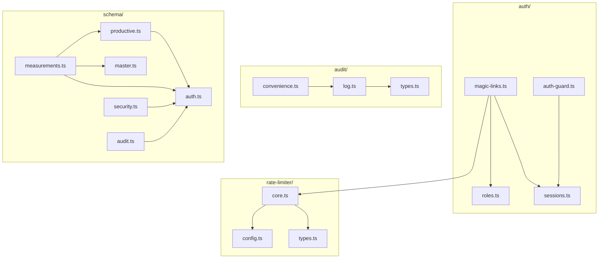

# Diseño de División de Módulos del Servidor

## Resumen Ejecutivo

Se propone dividir 4 archivos del servidor en módulos más pequeños y mantenibles, siguiendo el patrón ya establecido en `src/lib/server/auth/` con `roles.ts` y `sessions.ts`.

---

## 1. Análisis de Archivos Actuales

### 1.1 `auth.ts` (8684 chars, 273 líneas)

**Contenido actual:**
- Re-exports de `roles.ts` y `sessions.ts` (ya divididos)
- [`validateMagicLinkRateLimits()`](src/lib/server/auth.ts:42) - validación de rate limits
- [`buildMagicLinkEmailHtml()`](src/lib/server/auth.ts:67) - construcción de HTML para emails
- [`createMagicLink()`](src/lib/server/auth.ts:95) - creación y envío de magic links
- [`verifyTokenAndGetSession()`](src/lib/server/auth.ts:158) - verificación de token y creación de sesión
- [`authGuard()`](src/lib/server/auth.ts:223) - guard de autenticación

**Problema:** Mezcla lógica de magic links, validación de rate limits, construcción de emails y autenticación JWT.

### 1.2 `rateLimiter.ts` (6179 chars, 232 líneas)

**Contenido actual:**
- Constantes de configuración (líneas 8-23)
- Tipos: [`RateLimitType`](src/lib/server/rateLimiter.ts:27), [`RateLimitResult`](src/lib/server/rateLimiter.ts:29), [`CooldownResult`](src/lib/server/rateLimiter.ts:36)
- [`checkRateLimit()`](src/lib/server/rateLimiter.ts:50) - verificación de rate limit
- [`logRateLimitAttempt()`](src/lib/server/rateLimiter.ts:113) - registro de intentos
- [`checkEmailCooldown()`](src/lib/server/rateLimiter.ts:129) - verificación de cooldown
- [`updateEmailCooldown()`](src/lib/server/rateLimiter.ts:175) - actualización de cooldown
- [`cleanupOldRateLimits()`](src/lib/server/rateLimiter.ts:203) - limpieza de registros
- [`formatTime()`](src/lib/server/rateLimiter.ts:225) - utilidad privada

**Problema:** Archivo cohesivo pero con configuración, tipos y lógica mezclados.

### 1.3 `audit.ts` (4999 chars, 242 líneas)

**Contenido actual:**
- Tipo [`AccionAuditoria`](src/lib/server/audit.ts:6) (union type)
- Interfaz [`AuditLogParams`](src/lib/server/audit.ts:20)
- [`logAuditEvent()`](src/lib/server/audit.ts:36) - función principal
- 9 funciones de conveniencia: `logLoginSuccess`, `logLoginFailed`, `logMagicLinkSent`, `logLogout`, `logApiKeyGenerated`, `logApiKeyRevoked`, `logApiAccess`, `logDataExport`, `logUserCreated`, `logRoleChange`

**Problema:** Archivo cohesivo pero con muchas funciones de conveniencia que podrían agruparse.

### 1.4 `schema.ts` (7221 chars, 213 líneas)

**Contenido actual:**
- Tablas de autenticación: `usuarios`, `magicLinkTokens`, `sesiones`
- Tablas productivas: `lugares`, `ciclos`
- Tablas maestras: `tiposRegistro`, `origenDatos`
- Tablas de hechos: `mediciones`
- Tablas de seguridad: `consentimientos`, `apiKeys`, `rateLimitLogs`, `emailCooldowns`
- Tablas de auditoría: `auditLogs`

**Problema:** Un solo archivo con todas las tablas de la base de datos, dificultando la navegación y el mantenimiento.

---

## 2. Propuesta de Estructura

### 2.1 Estructura de Carpetas Resultante

```
src/lib/server/
├── auth.ts                    # Re-exports para compatibilidad
├── auth/
│   ├── index.ts               # Re-exports centralizados
│   ├── roles.ts               # ✅ Ya existe
│   ├── sessions.ts            # ✅ Ya existe
│   ├── magic-links.ts         # 🆕 Nuevo: magic links
│   └── auth-guard.ts          # 🆕 Nuevo: authGuard
├── rateLimiter.ts             # Re-exports para compatibilidad
├── rate-limiter/
│   ├── index.ts               # Re-exports centralizados
│   ├── config.ts              # 🆕 Nuevo: constantes
│   ├── types.ts               # 🆕 Nuevo: tipos
│   └── core.ts                # 🆕 Nuevo: funciones principales
├── audit.ts                   # Re-exports para compatibilidad
├── audit/
│   ├── index.ts               # Re-exports centralizados
│   ├── types.ts               # 🆕 Nuevo: tipos
│   ├── log.ts                 # 🆕 Nuevo: función principal
│   └── convenience.ts         # 🆕 Nuevo: funciones de conveniencia
├── db/
│   ├── index.ts               # ✅ Ya existe
│   ├── schema.ts              # Re-exports para compatibilidad
│   └── schema/
│       ├── index.ts           # Re-exports centralizados
│       ├── auth.ts            # 🆕 Nuevo: usuarios, magicLinkTokens, sesiones
│       ├── productive.ts      # 🆕 Nuevo: lugares, ciclos
│       ├── master.ts          # 🆕 Nuevo: tiposRegistro, origenDatos
│       ├── measurements.ts    # 🆕 Nuevo: mediciones
│       ├── security.ts        # 🆕 Nuevo: consentimientos, apiKeys, rateLimitLogs, emailCooldowns
│       └── audit.ts           # 🆕 Nuevo: auditLogs
```

---

## 3. Detalle por Archivo

### 3.1 División de `auth.ts`

#### `auth/magic-links.ts` (nuevo)
```typescript
// Contenido:
// - validateMagicLinkRateLimits()
// - buildMagicLinkEmailHtml()
// - createMagicLink()
// - verifyTokenAndGetSession()
// - MAGIC_LINK_EXPIRATION_MS (constante)
// - MagicLinkResult (tipo)

// Imports necesarios:
import { db } from '../db';
import { usuarios, magicLinkTokens } from '../db/schema';
import { Resend } from 'resend';
import { env } from '$env/dynamic/private';
import { randomBytes } from 'crypto';
import { checkRateLimit, logRateLimitAttempt, checkEmailCooldown, updateEmailCooldown } from '../rate-limiter';
import { ROLES } from './roles';
import { hashToken, createSession } from './sessions';
```

#### `auth/auth-guard.ts` (nuevo)
```typescript
// Contenido:
// - authGuard()

// Imports necesarios:
import { env } from '$env/dynamic/private';
import pkg from 'jsonwebtoken';
import { validateSession, invalidateSession } from './sessions';
import type { Rol } from './roles';
```

#### `auth/index.ts` (nuevo)
```typescript
// Re-exports centralizados
export { ROLES, requireRole, hasMinRole } from './roles';
export type { Rol } from './roles';
export { createSession, invalidateSession, invalidateAllUserSessions, validateSession, hashToken } from './sessions';
export { createMagicLink, verifyTokenAndGetSession, type MagicLinkResult } from './magic-links';
export { authGuard } from './auth-guard';
```

#### `auth.ts` (modificado - solo re-exports)
```typescript
// Mantener compatibilidad hacia atrás
export * from './auth/index';
```

---

### 3.2 División de `rateLimiter.ts`

#### `rate-limiter/config.ts` (nuevo)
```typescript
// Contenido:
// - IP_RATE_LIMIT (constante)
// - EMAIL_RATE_LIMIT (constante)
// - EMAIL_COOLDOWN_MS (constante)
// - CLEANUP_THRESHOLD_MS (constante)
```

#### `rate-limiter/types.ts` (nuevo)
```typescript
// Contenido:
// - RateLimitType (tipo)
// - RateLimitResult (interfaz)
// - CooldownResult (interfaz)
```

#### `rate-limiter/core.ts` (nuevo)
```typescript
// Contenido:
// - checkRateLimit()
// - logRateLimitAttempt()
// - checkEmailCooldown()
// - updateEmailCooldown()
// - cleanupOldRateLimits()
// - formatTime() (privada)

// Imports necesarios:
import { db } from '../db';
import { rateLimitLogs, emailCooldowns } from '../db/schema';
import { IP_RATE_LIMIT, EMAIL_RATE_LIMIT, EMAIL_COOLDOWN_MS, CLEANUP_THRESHOLD_MS } from './config';
import type { RateLimitType, RateLimitResult, CooldownResult } from './types';
```

#### `rate-limiter/index.ts` (nuevo)
```typescript
// Re-exports centralizados
export { IP_RATE_LIMIT, EMAIL_RATE_LIMIT, EMAIL_COOLDOWN_MS, CLEANUP_THRESHOLD_MS } from './config';
export type { RateLimitType, RateLimitResult, CooldownResult } from './types';
export { checkRateLimit, logRateLimitAttempt, checkEmailCooldown, updateEmailCooldown, cleanupOldRateLimits } from './core';
```

#### `rateLimiter.ts` (modificado - solo re-exports)
```typescript
// Mantener compatibilidad hacia atrás
export * from './rate-limiter/index';
```

---

### 3.3 División de `audit.ts`

#### `audit/types.ts` (nuevo)
```typescript
// Contenido:
// - AccionAuditoria (tipo)
// - AuditLogParams (interfaz)
```

#### `audit/log.ts` (nuevo)
```typescript
// Contenido:
// - logAuditEvent()

// Imports necesarios:
import { db } from '../db';
import { auditLogs } from '../db/schema';
import type { AccionAuditoria, AuditLogParams } from './types';
```

#### `audit/convenience.ts` (nuevo)
```typescript
// Contenido:
// - logLoginSuccess()
// - logLoginFailed()
// - logMagicLinkSent()
// - logLogout()
// - logApiKeyGenerated()
// - logApiKeyRevoked()
// - logApiAccess()
// - logDataExport()
// - logUserCreated()
// - logRoleChange()

// Imports necesarios:
import { logAuditEvent } from './log';
import type { AccionAuditoria } from './types';
```

#### `audit/index.ts` (nuevo)
```typescript
// Re-exports centralizados
export type { AccionAuditoria, AuditLogParams } from './types';
export { logAuditEvent } from './log';
export {
  logLoginSuccess,
  logLoginFailed,
  logMagicLinkSent,
  logLogout,
  logApiKeyGenerated,
  logApiKeyRevoked,
  logApiAccess,
  logDataExport,
  logUserCreated,
  logRoleChange
} from './convenience';
```

#### `audit.ts` (modificado - solo re-exports)
```typescript
// Mantener compatibilidad hacia atrás
export * from './audit/index';
```

---

### 3.4 División de `schema.ts`

#### `schema/auth.ts` (nuevo)
```typescript
// Contenido:
// - usuarios (tabla)
// - magicLinkTokens (tabla)
// - sesiones (tabla)

// Imports necesarios:
import { pgTable, text, integer, boolean, timestamp, serial } from 'drizzle-orm/pg-core';
```

#### `schema/productive.ts` (nuevo)
```typescript
// Contenido:
// - lugares (tabla con índice GIST)
// - ciclos (tabla)

// Imports necesarios:
import { pgTable, text, integer, boolean, timestamp, serial, real, geometry, index } from 'drizzle-orm/pg-core';
import { usuarios } from './auth';
```

#### `schema/master.ts` (nuevo)
```typescript
// Contenido:
// - tiposRegistro (tabla)
// - origenDatos (tabla)

// Imports necesarios:
import { pgTable, text, serial } from 'drizzle-orm/pg-core';
```

#### `schema/measurements.ts` (nuevo)
```typescript
// Contenido:
// - mediciones (tabla)

// Imports necesarios:
import { pgTable, text, integer, real, timestamp, serial } from 'drizzle-orm/pg-core';
import { ciclos } from './productive';
import { lugares } from './productive';
import { usuarios } from './auth';
import { tiposRegistro } from './master';
import { origenDatos } from './master';
```

#### `schema/security.ts` (nuevo)
```typescript
// Contenido:
// - consentimientos (tabla)
// - apiKeys (tabla)
// - rateLimitLogs (tabla)
// - emailCooldowns (tabla)

// Imports necesarios:
import { pgTable, text, integer, timestamp, serial } from 'drizzle-orm/pg-core';
import { usuarios } from './auth';
```

#### `schema/audit.ts` (nuevo)
```typescript
// Contenido:
// - auditLogs (tabla)

// Imports necesarios:
import { pgTable, text, integer, timestamp, serial } from 'drizzle-orm/pg-core';
import { usuarios } from './auth';
```

#### `schema/index.ts` (nuevo)
```typescript
// Re-exports centralizados
export { usuarios, magicLinkTokens, sesiones } from './auth';
export { lugares, ciclos } from './productive';
export { tiposRegistro, origenDatos } from './master';
export { mediciones } from './measurements';
export { consentimientos, apiKeys, rateLimitLogs, emailCooldowns } from './security';
export { auditLogs } from './audit';
```

#### `schema.ts` (modificado - solo re-exports)
```typescript
// Mantener compatibilidad hacia atrás
export * from './schema/index';
```

---

## 4. Estrategia de Compatibilidad

### 4.1 Principio
Todos los archivos originales (`auth.ts`, `rateLimiter.ts`, `audit.ts`, `schema.ts`) se mantienen como puntos de entrada que solo contienen re-exports. Esto garantiza que:

1. **Imports existentes siguen funcionando** sin cambios
2. **Tests existentes no requieren modificación**
3. **Transición gradual** - se puede migrar imports gradualmente

### 4.2 Patrón de Re-export
```typescript
// Archivo original (ej: auth.ts)
export * from './auth/index';

// Archivo index.ts del módulo
export { funcionA } from './submodulo-a';
export { funcionB } from './submodulo-b';
export type { TipoA } from './types';
```

### 4.3 Imports Recomendados para Código Nuevo
```typescript
// ❌ No recomendado (aunque funciona)
import { authGuard } from '$lib/server/auth';

// ✅ Recomendado para código nuevo
import { authGuard } from '$lib/server/auth/auth-guard';
```

---

## 5. Dependencias entre Módulos



---

## 6. Riesgos y Consideraciones

### 6.1 Riesgos Identificados

| Riesgo | Impacto | Mitigación |
|--------|---------|------------|
| Imports circulares en schema | Alto | Usar `import type` donde sea posible; verificar con TypeScript |
| Tests fallen por cambios de ruta | Medio | Mantener re-exports en archivos originales |
| Drizzle ORM no resuelve referencias | Alto | Verificar que las foreign keys funcionen con imports relativos |

### 6.2 Supuestos

1. **Drizzle ORM soporta imports distribuidos** - Las referencias `references(() => tabla.id)` funcionan con imports desde otros archivos
2. **No hay imports dinámicos** - No se usan `import()` dinámicos que puedan romperse
3. **Tests usan imports desde archivos originales** - Los tests importan desde `$lib/server/auth` no desde submódulos

### 6.3 Verificaciones Necesarias Pre-Implementación

1. Ejecutar `npm run check` después de cada división
2. Ejecutar tests existentes para verificar compatibilidad
3. Verificar que Drizzle migrations siguen funcionando

---

## 7. Lista de Tareas de Implementación

### Fase 1: Preparación
- [ ] Crear carpetas `rate-limiter/`, `audit/`, `schema/`
- [ ] Verificar que no hay imports circulares potenciales

### Fase 2: División de schema.ts (prioridad alta - sin dependencias)
- [ ] Crear `schema/auth.ts` con usuarios, magicLinkTokens, sesiones
- [ ] Crear `schema/master.ts` con tiposRegistro, origenDatos
- [ ] Crear `schema/productive.ts` con lugares, ciclos
- [ ] Crear `schema/measurements.ts` con mediciones
- [ ] Crear `schema/security.ts` con consentimientos, apiKeys, rateLimitLogs, emailCooldowns
- [ ] Crear `schema/audit.ts` con auditLogs
- [ ] Crear `schema/index.ts` con re-exports
- [ ] Modificar `schema.ts` para solo re-exports
- [ ] Ejecutar `npm run check` y verificar tipos
- [ ] Ejecutar tests

### Fase 3: División de rateLimiter.ts
- [ ] Crear `rate-limiter/config.ts` con constantes
- [ ] Crear `rate-limiter/types.ts` con tipos
- [ ] Crear `rate-limiter/core.ts` con funciones
- [ ] Crear `rate-limiter/index.ts` con re-exports
- [ ] Modificar `rateLimiter.ts` para solo re-exports
- [ ] Ejecutar `npm run check` y verificar tipos
- [ ] Ejecutar tests

### Fase 4: División de audit.ts
- [ ] Crear `audit/types.ts` con tipos
- [ ] Crear `audit/log.ts` con logAuditEvent
- [ ] Crear `audit/convenience.ts` con funciones de conveniencia
- [ ] Crear `audit/index.ts` con re-exports
- [ ] Modificar `audit.ts` para solo re-exports
- [ ] Ejecutar `npm run check` y verificar tipos
- [ ] Ejecutar tests

### Fase 5: División de auth.ts
- [ ] Crear `auth/magic-links.ts` con funciones de magic link
- [ ] Crear `auth/auth-guard.ts` con authGuard
- [ ] Crear `auth/index.ts` con re-exports (actualizar existente si aplica)
- [ ] Modificar `auth.ts` para solo re-exports
- [ ] Ejecutar `npm run check` y verificar tipos
- [ ] Ejecutar tests

### Fase 6: Verificación Final
- [ ] Ejecutar suite completa de tests
- [ ] Verificar que Drizzle migrations funcionan
- [ ] Verificar que la aplicación inicia correctamente

---

## 8. Validación Requerida

Por favor confirma si deseas:

1. **Aprobar el plan tal como está** - Proceder con la implementación
2. **Ajustar el alcance** - Modificar qué archivos dividir o cómo dividirlos
3. **Modificar prioridades** - Cambiar el orden de implementación
4. **Aclarar dudas** - Resolver cualquier pregunta sobre el diseño